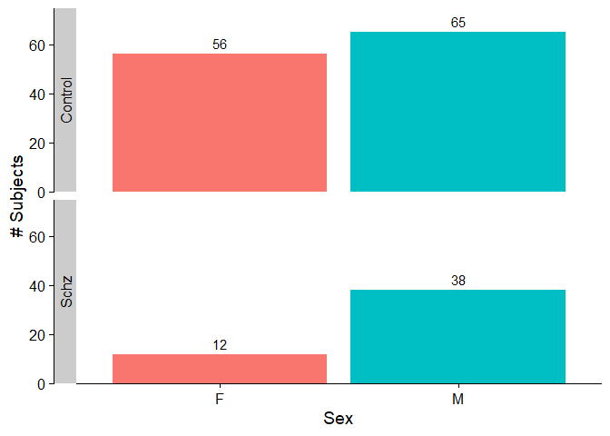
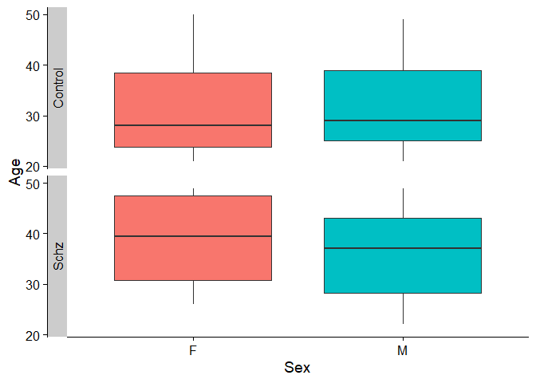

# fMRI time-series data preparation

The fMRI time-series data (and other metadata) are initially stored in Matlab .mat configuration files. To convert this data into an R-friendly format, please refer to the script load_mat_data.R in this repository.

### Loading .mat data

First, make note of the three R packages needed for this component:  
* `tidyverse`
* `R.matlab`
* `argparse`


`load_mat_data.R` should be run on the command line and takes the following four arguments:  
* `--mat_file`: Path to the .mat file containing time-series data for the UCLA cohort (i.e. path to "UCLA_time_series_four_groups.mat")
* `--label_metadata`: Path to the .csv file containing metadata about the UCLA cohort subjects (i.e. path to "participants.csv")
* `--data_path`: Path to all UCLA data for this project. The script will automatically create a subdirectory called "Rdata/" if it doesn't already exist.
* `--overwrite`: [*Optional*] Should an Rds object be overwritten if it already exists? Default is False.

Here's an example of how this script might be run:

```
Rscript load_mat_data.R \
--mat_file ~/data/UCLA/new/UCLA_time_series_four_groups.mat \
--label_metadata ~/data/UCLA/participants.csv \
--data_path ~/data/UCLA/
```

There should be three new .Rds objects in the Rdata/ subdirectory within your `data_path`, one for each noise processing method:
* AROMA + 2P
* AROMA + 2P + GMR
* AROMA + 2P + DiCER

To explore the data, load one of these into your R workspace using the `readRDS` function (substituting your own data path):
```
UCLA_AROMA_2P <- readRDS("~/data/UCLA/Rdata/UCLA_AROMA_2P.Rds")
head(UCLA_AROMA_2P)
```


```
##   timepoint      value Subject_ID diagnosis noise_proc    Brain_Region
## 1         1  6.9242045  sub-10159   Control   AROMA+2P ctx-lh-bankssts
## 2         2  3.3502121  sub-10159   Control   AROMA+2P ctx-lh-bankssts
## 3         3  0.9038174  sub-10159   Control   AROMA+2P ctx-lh-bankssts
## 4         4  1.5817101  sub-10159   Control   AROMA+2P ctx-lh-bankssts
## 5         5 -1.0898593  sub-10159   Control   AROMA+2P ctx-lh-bankssts
## 6         6  3.7718775  sub-10159   Control   AROMA+2P ctx-lh-bankssts
```


### Visualize subject breakdown

The `load_mat_data.R` script automatically generates a CSV file containing the list of control and schizophrenia subjects with time-series data ("Rdata/UCLA_subjects_with_TS_data.csv"). 

```
source("subject_info_breakdown.R")
get_dx_breakdown("~/data/UCLA/Rdata/UCLA_subjects_with_TS_data.csv")
```


```
##   Control Schizophrenia Total  SCZ2Ctrl
## 1     121            50   171 0.4132231
```

To examine the distribution of sex vs. diagnosis, we can use the function `plot_dx_vs_sex_count()`:

```
plot_dx_vs_sex_count("~/data/UCLA/Rdata/UCLA_subjects_with_TS_data.csv")
```

<!-- -->

To examine the distribution of ages across diagnosis:

```
plot_dx_vs_sex_age("~/data/UCLA/Rdata/UCLA_subjects_with_TS_data.csv")
```
<!-- -->


### Run catch22 feature extraction
