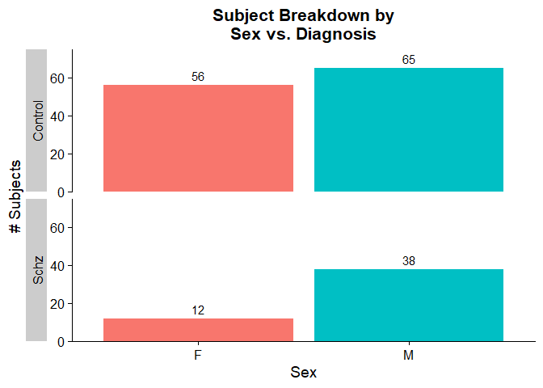
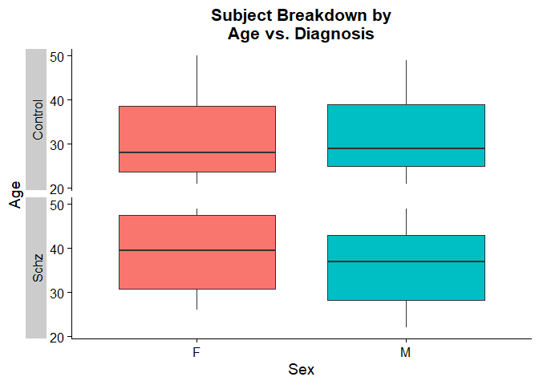

Data Preparation
================

# fMRI time-series data preparation

The fMRI time-series data (and other metadata) are initially stored in
Matlab .mat configuration files. To convert this data into an R-friendly
format, please refer to the script load_mat_data.R in this repository.

### Loading .mat data

First, make note of the three R packages needed for this component:  
\* `tidyverse` \* `R.matlab` \* `argparse`

Source the data preparation functions:

``` r
source("data_prep_functions.R")
```

Run the loading function:

``` r
# Define paths
mat_file = "~/data/UCLA_time_series_four_groups.mat"
subject_csv = "~/data/participants.csv"
rdata_path = "~/data/Rdata/"

# Create Rdata directory if it doesn't already exist
if (!dir.exists(rdata_path)) {
  dir.create(rdata_path)
}

# Run loading function
load_mat_data(mat_file=mat_file, 
              subject_csv=subject_csv, 
              rdata_path=rdata_path, 
              overwrite=FALSE)
```

There should be three new .Rds objects in the Rdata/ subdirectory within
your `data_path`, one for each noise processing method: \* AROMA + 2P \*
AROMA + 2P + GMR \* AROMA + 2P + DiCER

To explore the data, load one of these into your R workspace using the
`readRDS` function (substituting your own data path):

``` r
UCLA_AROMA_2P <- readRDS("~/data/UCLA/Rdata/UCLA_AROMA_2P.Rds")
head(UCLA_AROMA_2P)
```

    ##   timepoint      value Subject_ID diagnosis noise_proc    Brain_Region
    ## 1         1  6.9242045  sub-10159   Control   AROMA+2P ctx-lh-bankssts
    ## 2         2  3.3502121  sub-10159   Control   AROMA+2P ctx-lh-bankssts
    ## 3         3  0.9038174  sub-10159   Control   AROMA+2P ctx-lh-bankssts
    ## 4         4  1.5817101  sub-10159   Control   AROMA+2P ctx-lh-bankssts
    ## 5         5 -1.0898593  sub-10159   Control   AROMA+2P ctx-lh-bankssts
    ## 6         6  3.7718775  sub-10159   Control   AROMA+2P ctx-lh-bankssts

### Visualize subject breakdown

The `load_mat_data()` function automatically generates a CSV file
containing the list of control and schizophrenia subjects with
time-series data (“Rdata/UCLA_subjects_with_TS_data.csv”).

``` r
get_dx_breakdown("~/data/UCLA/Rdata/UCLA_subjects_with_TS_data.csv")
```

    ##   Control Schizophrenia Total  SCZ2Ctrl
    ## 1     121            50   171 0.4132231

To examine the distribution of sex vs. diagnosis, we can use the
function `plot_dx_vs_sex_count()`:

``` r
plot_dx_vs_sex_count("~/data/Rdata/UCLA_subjects_with_TS_data.csv")
```

<!-- -->

To examine the distribution of ages across diagnosis:

``` r
plot_dx_vs_sex_age("~/data/Rdata/UCLA_subjects_with_TS_data.csv")
```

<!-- -->

### Run catch22 feature extraction

``` r
# Run catch22 on time-series data for each noise processing method
for (noise_proc in c("AROMA+2P", "AROMA+2P+GMR", "AROMA+2P+DiCER")) {
  
  # Clean up noise processing label for file naming
  noise_label <- gsub("\\+", "_", noise_proc)
  
  # Create Rds file for given noise processing method if it doesn't already exist
  if (!file.exists(paste0(rdata_path, sprintf("UCLA_%s_catch22.Rds", 
                                              noise_label)))) {
    
    # Read in time-series data
    TS_df <- readRDS(paste0(rdata_path, sprintf("UCLA_%s.Rds", noise_label)))
    cat("\nNow running catch22 for UCLA", noise_proc, "data.\n")
    
    # Run catch22 on a region-wise basis for all ROIs
    TS_catch22 <- catch22_all_regions(TS_df=TS_df)
    
    # Save resulting time-series features to an .Rds file
    saveRDS(TS_catch22, file=paste0(rdata_path, sprintf("UCLA_%s_catch22.Rds", 
                                                        noise_label)))
    remove(TS_df)
  }
  # clean up memory
  gc()
}
```
