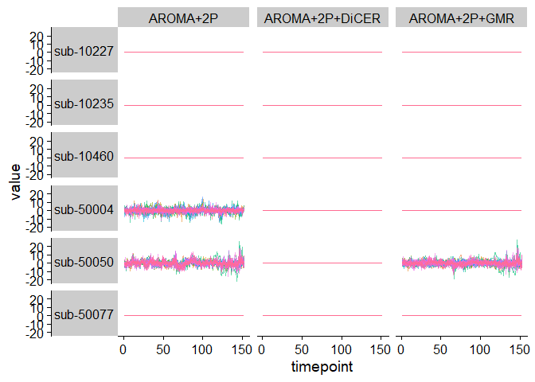
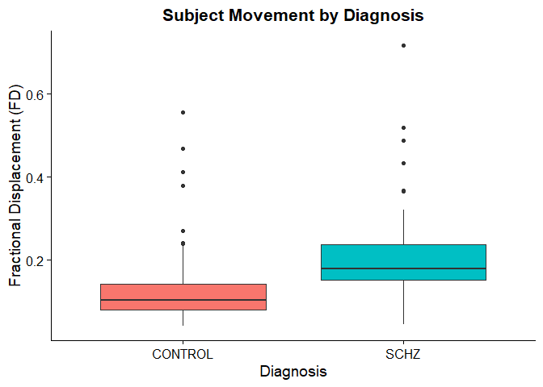
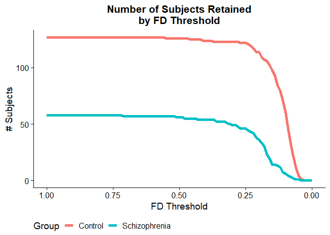

Quality Control
================

### Source functions

``` r
source("QC_functions.R")
```

### NA values

One thing to look at is how many features showed up as NA across each
subject by noise processing method.

``` r
theme_set(cowplot::theme_cowplot())
data_path <- "D:/Virtual_Machines/Shared_Folder/PhD_work/data/scz/UCLA/"
rdata_path <- paste0(data_path, "Rdata/")

NA_subjects_data <- find_catch22_na(rdata_path = rdata_path)
NA_subjects_data
```

    ## # A tibble: 6 x 4
    ## # Groups:   Subject_ID [6]
    ##   Subject_ID `AROMA+2P` `AROMA+2P+DiCER` `AROMA+2P+GMR`
    ##   <chr>           <int>            <int>          <int>
    ## 1 sub-10227        1558             1558           1558
    ## 2 sub-10235        1558             1558           1558
    ## 3 sub-10460        1558             1558           1558
    ## 4 sub-50004          NA             1558           1558
    ## 5 sub-50050          NA             1558             NA
    ## 6 sub-50077        1558             1558           1558

This shows that there are six subjects for whom catch22 returned NA
values for all ROIs (82) and 19 out of the 22 features for a total of
1,558 NAs per subject. We can load in the raw time-series datasets and
view the raw values for these subjects.

``` r
plot_catch22_na_ts(rdata_path=rdata_path, 
                   subject_IDs=NA_subjects_data$Subject_ID)
```

<!-- -->

### Movement – fractional displacement

We can compile the subjects’ average fractional displacement (FD) in the
scanner into a dataframe:

``` r
movement_data <- compile_movement_data(fd_path=paste0(data_path, "movementData/"),
                                       subject_csv = paste0(data_path, "participants.csv"))

head(movement_data)
```

    ##   Subject_ID diagnosis       FD
    ## 1  sub-10150   CONTROL 0.101920
    ## 2  sub-10159   CONTROL 0.118020
    ## 3  sub-10171   CONTROL 0.233230
    ## 4  sub-10189   CONTROL 0.196420
    ## 5  sub-10195   CONTROL 0.093211
    ## 6  sub-10206   CONTROL 0.082432

Visualize the average FD by diagnosis in a boxplot:

``` r
plot_FD_vs_diagnosis(movement_data = movement_data)
```

<!-- -->

Plot the number of subjects retained at each FD threshold:

``` r
plot_subjects_per_fd_threshold(movement_data)
```

<!-- -->
