Step 3: ROI-Wise catch22 Feature Analysis
================

### Source functions

``` r
source("../helper_functions/visualization_functions.R")
source("ROI_wise_analysis_functions.R")
source("D:/Virtual_Machines/Shared_Folder/github/theft-trent/R/fit_multi_feature_classifier.R")
rdata_path <- "D:/Virtual_Machines/Shared_Folder/PhD_work/data/scz/UCLA/Rdata/"
```

## In-sample SVM classification

### Simple in-sample linear SVM

We will start with a simple linear SVM classifier using all 22 features.

``` r
# Compare all three noise processing methods
noise_procs = c("AROMA+2P", "AROMA+2P+GMR", "AROMA+2P+DiCER")

# Use linear SVM
svm_kernel = "linear"

# Run theft's multivariable classifier on each ROI and save to an RDS object
# If the RDS object doesn't already exist, otherwise load it in
if (!file.exists(paste0(rdata_path, "UCLA_multivar_ROI_res_svmLinear_in_sample.Rds"))) {
  region_wise_SVM_in_sample <- run_in_sample_ksvm_by_region(rdata_path = rdata_path,
                                                                         svm_kernel = svm_kernel,
                                                                         noise_procs = noise_procs,
                                                            use_inv_prob_weighting = FALSE,
                                                            upsample_minority = FALSE,
                                                            downsample_majority = FALSE) %>%
    dplyr::rename("accuracy" = "Accuracy",
                  "balanced_accuracy" = "Balanced_Accuracy")
  saveRDS(region_wise_SVM_in_sample, file=paste0(rdata_path, "UCLA_multivar_ROI_res_svmLinear_in_sample.Rds"))
} else {
  region_wise_SVM_in_sample <- readRDS(paste0(rdata_path, "UCLA_multivar_ROI_res_svmLinear_in_sample.Rds"))
}
```

``` r
# Plot accuracy + balanced accuracy in histograms
# Control subject proportion is highlighted for accuracy
noise_procs = c("AROMA+2P", "AROMA+2P+GMR", "AROMA+2P+DiCER")
plot_class_acc_w_props(class_res = region_wise_SVM_in_sample,
                       cv = FALSE,
                       rdata_path = rdata_path,
                       noise_procs = noise_procs)
```

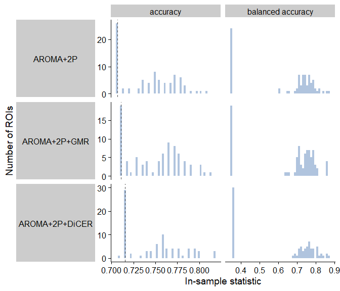<!-- -->

The figure on the left shows the results from running theft’s
multivariable classifier using all 22 catch22 features with svmLinear
(kernlab) in caret.

The dashed line shows the proportion of control subjects in the
population for Accuracy (left half).

Clearly, the classification algorithm is biased for the majority of ROIs
to classify all samples as controls in order to achieve a raw accuracy
of \~0.7. Similarly, the balanced accuracy is centered around 0.35.

This highlights the need to mitigate the class imbalances, either with
inverse probability sample weighting or minority class upsampling.

### In-sample linear SVM with inverse probability weighting

We can run linear SVM with the `kernlab` package to directly test sample
reweighting with in-sample accuracy and balanced accuracy.

``` r
# Compare all three noise processing methods
noise_procs = c("AROMA+2P", "AROMA+2P+GMR", "AROMA+2P+DiCER")

# Use linear SVM
svm_kernel = "linear"

# Run theft's multivariable classifier on each ROI and save to an RDS object
# If the RDS object doesn't already exist, otherwise load it in
if (!file.exists(paste0(rdata_path, "UCLA_multivar_ROI_res_svmLinear_in_sample_reweight.Rds"))) {
  region_wise_SVM_in_sample_inv_prob <- run_in_sample_ksvm_by_region_inv_prob(rdata_path = rdata_path,
                                                                         svm_kernel = svm_kernel,
                                                                         noise_procs = noise_procs) %>%
    dplyr::rename("accuracy" = "Accuracy",
                  "balanced_accuracy" = "Balanced_Accuracy")
  saveRDS(region_wise_SVM_in_sample_inv_prob, file=paste0(rdata_path, "UCLA_multivar_ROI_res_svmLinear_in_sample_reweight.Rds"))
} else {
  region_wise_SVM_in_sample_inv_prob <- readRDS(paste0(rdata_path, "UCLA_multivar_ROI_res_svmLinear_in_sample_reweight.Rds"))
}
```

``` r
# Plot accuracy + balanced accuracy in histograms
# Control subject proportion is highlighted for accuracy
noise_procs = c("AROMA+2P", "AROMA+2P+GMR", "AROMA+2P+DiCER")
plot_class_acc_w_props(class_res = region_wise_SVM_in_sample_inv_prob,
                       cv = FALSE,
                       rdata_path = rdata_path,
                       noise_procs = noise_procs)
```

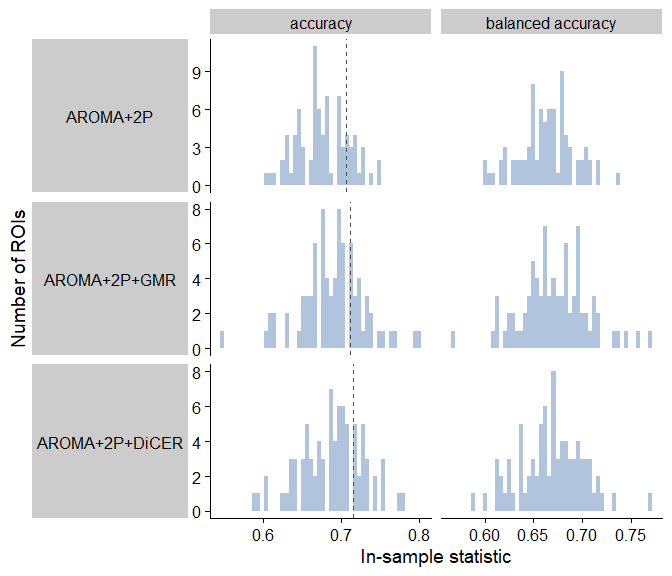<!-- -->

By assigning each subject a weight equivalent to the inverse proportion
of that subject’s diagnosis, the linear SVM places a higher cost on
incorrectly classifying schizophrenia subjects as controls.

This shifts the raw accuracy down to a mean of around 0.68 across the
three noise-processing methods, but the balanced accuracy increases to
have an average of around 0.68 also – compared with almost exclusively
values of 0.35 previously.

This indicates that inverse probability reweighting mitigates the class
imbalance issue and can be carried forward into 10-fold cross-validation
linear SVM.

### In-sample linear SVM with minority class upsampling

``` r
# Compare all three noise processing methods
noise_procs = c("AROMA+2P", "AROMA+2P+GMR", "AROMA+2P+DiCER")

# Use linear SVM
svm_kernel = "linear"

# Run theft's multivariable classifier on each ROI and save to an RDS object
# If the RDS object doesn't already exist, otherwise load it in
if (!file.exists(paste0(rdata_path, "UCLA_multivar_ROI_res_svmLinear_in_sample_upsampled.Rds"))) {
  set.seed(127)
  region_wise_SVM_in_sample_upsampled <- run_in_sample_ksvm_by_region(rdata_path = rdata_path,
                                                                         svm_kernel = svm_kernel,
                                                                         noise_procs = noise_procs,
                                                                      use_inv_prob_weighting = FALSE,
                                                                      upsample_minority = TRUE,
                                                                      downsample_majority = FALSE) %>%
    dplyr::rename("accuracy" = "Accuracy",
                  "balanced_accuracy" = "Balanced_Accuracy")
  saveRDS(region_wise_SVM_in_sample_upsampled, file=paste0(rdata_path, "UCLA_multivar_ROI_res_svmLinear_in_sample_upsampled.Rds"))
} else {
  region_wise_SVM_in_sample_upsampled <- readRDS(paste0(rdata_path, "UCLA_multivar_ROI_res_svmLinear_in_sample_upsampled.Rds"))
}
```

``` r
# Plot accuracy + balanced accuracy in histograms
# Control subject proportion is highlighted for accuracy
noise_procs = c("AROMA+2P", "AROMA+2P+GMR", "AROMA+2P+DiCER")
plot_class_acc_w_props(class_res = region_wise_SVM_in_sample_upsampled,
                       cv = FALSE,
                       rdata_path = rdata_path,
                       noise_procs = noise_procs)
```

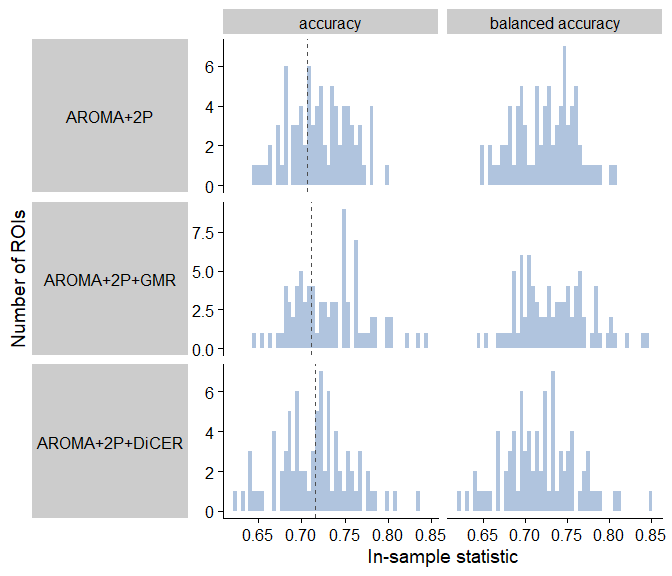<!-- -->

Alternatively, we can implement upsampling for the minority class
(schizophrenia) such that the classes are perfectly balanced. This
involves randomly sampling the schizophrenia subjects with replacement N
times, where N is the number of control subjects (i.e. majority class).

This takes away the classifier’s bias toward the majority class. The
mean accuracy is right around 0.72, and the balanced accuracy is much
higher – with a mean of around 0.72 as well.

This indicates that minority class upsampling also mitigates the class
imbalance issue and can be carried forward into 10-fold cross-validation
linear SVM.

### In-sample linear SVM with majority class downsampling

``` r
# Compare all three noise processing methods
noise_procs = c("AROMA+2P", "AROMA+2P+GMR", "AROMA+2P+DiCER")

# Use linear SVM
svm_kernel = "linear"

# Run theft's multivariable classifier on each ROI and save to an RDS object
# If the RDS object doesn't already exist, otherwise load it in
if (!file.exists(paste0(rdata_path, "UCLA_multivar_ROI_res_svmLinear_in_sample_downsampled.Rds"))) {
  set.seed(127)
  region_wise_SVM_in_sample_downsampled <- run_in_sample_ksvm_by_region(rdata_path = rdata_path,
                                                                        svm_kernel = svm_kernel,
                                                                        noise_procs = noise_procs,
                                                                        use_inv_prob_weighting = FALSE,
                                                                        upsample_minority = FALSE,
                                                                        downsample_majority = TRUE) %>%
    dplyr::rename("accuracy" = "Accuracy",
                  "balanced_accuracy" = "Balanced_Accuracy")
  saveRDS(region_wise_SVM_in_sample_downsampled, file=paste0(rdata_path, "UCLA_multivar_ROI_res_svmLinear_in_sample_downsampled.Rds"))
} else {
  region_wise_SVM_in_sample_downsampled <- readRDS(paste0(rdata_path, "UCLA_multivar_ROI_res_svmLinear_in_sample_downsampled.Rds"))
}
```

``` r
# Plot accuracy + balanced accuracy in histograms
# Control subject proportion is highlighted for accuracy
noise_procs = c("AROMA+2P", "AROMA+2P+GMR", "AROMA+2P+DiCER")
plot_class_acc_w_props(class_res = region_wise_SVM_in_sample_downsampled,
                       cv = FALSE,
                       rdata_path = rdata_path,
                       noise_procs = noise_procs)
```

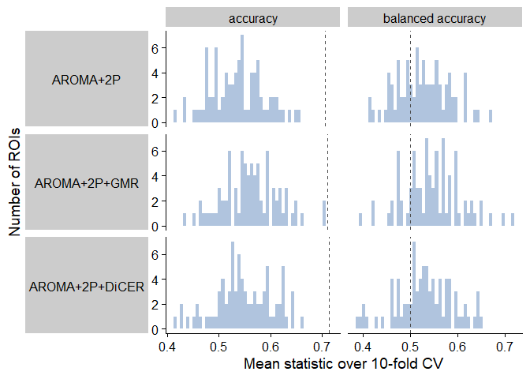<!-- -->

Alternatively, we can implement upsampling for the minority class
(schizophrenia) such that the classes are perfectly balanced. This
involves randomly sampling the schizophrenia subjects with replacement N
times, where N is the number of control subjects (i.e. majority class).

This takes away the classifier’s bias toward the majority class. The
mean accuracy is right around 0.72, and the balanced accuracy is much
higher – with a mean of around 0.72 as well.

This indicates that minority class upsampling also mitigates the class
imbalance issue and can be carried forward into 10-fold cross-validation
linear SVM.

## Cross-validated SVM classification

### 10-fold cross-validated linear SVM

We can implement 10-fold cross-validation (CV) with the `caret` package.

``` r
# Try three different noise processing methods
noise_procs = c("AROMA+2P", "AROMA+2P+GMR", "AROMA+2P+DiCER")

# Retain balanced accuracy in addition to raw accuracy for each ROI
use_balanced_accuracy <- TRUE

use_inv_prob_weighting = FALSE
upsample_minority = FALSE

# Run theft's multivariable classifier on each ROI and save to an RDS object
# If the RDS object doesn't already exist, otherwise load it in
if (!file.exists(paste0(rdata_path, "UCLA_multivar_ROI_res_svmLinear_CV.Rds"))) {
  
   region_wise_SVM_caret <- run_caret_multi_SVM_by_region(rdata_path = rdata_path,
                                            use_inv_prob_weighting = use_inv_prob_weighting,
                                            upsample_minority = upsample_minority,
                                            noise_procs = noise_procs)  %>%
    dplyr::rename("accuracy" = "Accuracy",
                  "balanced_accuracy" = "Balanced_Accuracy")
   
  saveRDS(region_wise_SVM_caret, file=paste0(rdata_path, "UCLA_multivar_ROI_res_svmLinear_CV.Rds"))
} else {
  region_wise_SVM_caret <- readRDS(paste0(rdata_path, "UCLA_multivar_ROI_res_svmLinear_CV.Rds"))
}
```

``` r
# Plot accuracy + balanced accuracy in histograms
# Control subject proportion is highlighted for accuracy
noise_procs = c("AROMA+2P", "AROMA+2P+GMR", "AROMA+2P+DiCER")
plot_class_acc_w_props(class_res = region_wise_SVM_caret,
                       cv = FALSE,
                       rdata_path = rdata_path,
                       noise_procs = noise_procs)
```

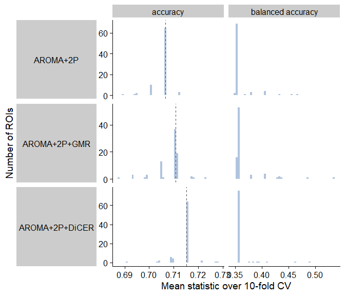<!-- -->

As with in-sample SVM, the unweighted input samples are virtually all
classified as control subjects across all 82 ROIs using the 10-fold
cross-validation linear SVM with caret.

### 10-fold cross-validated linear SVM with inverse probability weighting

``` r
# Try three different noise processing methods
noise_procs = c("AROMA+2P", "AROMA+2P+GMR", "AROMA+2P+DiCER")

# Retain balanced accuracy in addition to raw accuracy for each ROI
use_balanced_accuracy <- TRUE

# Implement inverse probability weighting
use_inv_prob_weighting = TRUE
upsample_minority = FALSE
downsample_majority = FALSE

# Run theft's multivariable classifier on each ROI and save to an RDS object
# If the RDS object doesn't already exist, otherwise load it in
if (!file.exists(paste0(rdata_path, "UCLA_multivar_ROI_res_svmLinear_inv_prob.Rds"))) {
  
   region_wise_SVM_caret_inv_prob_df <- run_caret_multi_SVM_by_region(rdata_path = rdata_path,
                                            use_inv_prob_weighting = use_inv_prob_weighting,
                                            upsample_minority = upsample_minority,
                                            downsample_majority = downsample_majority,
                                            noise_procs = noise_procs)  %>%
    dplyr::rename("accuracy" = "Accuracy",
                  "balanced_accuracy" = "Balanced_Accuracy")
   
  saveRDS(region_wise_SVM_caret_inv_prob_df, file=paste0(rdata_path, "UCLA_multivar_ROI_res_svmLinear_inv_prob.Rds"))
} else {
  region_wise_SVM_caret_inv_prob_df <- readRDS(paste0(rdata_path, "UCLA_multivar_ROI_res_svmLinear_inv_prob.Rds"))
}
```

``` r
plot_class_acc_w_props(class_res = region_wise_SVM_caret_inv_prob_df,
                       rdata_path = rdata_path,
                       noise_procs = noise_procs)
```

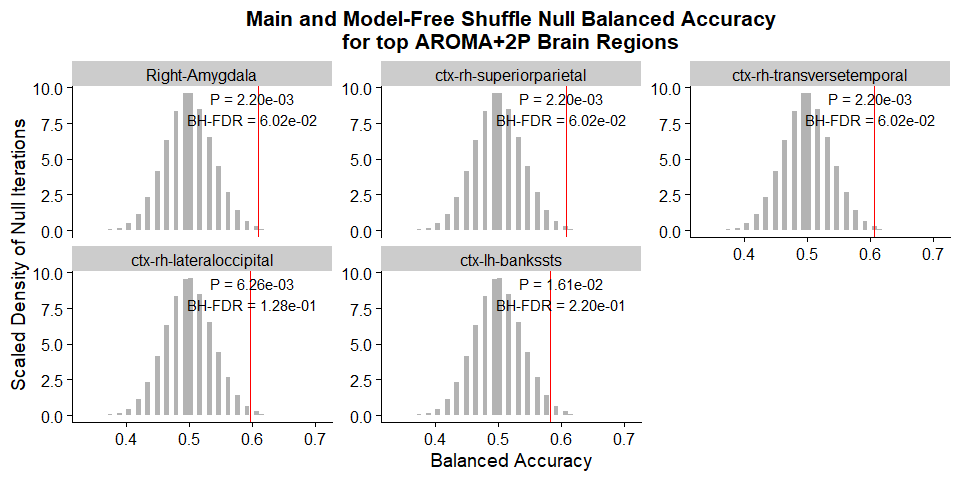<!-- -->

Surprisingly, incorporating inverse probability weighting has minimal
impact when it comes to the ten-fold cross-validated SVM. Of note, the
in-sample and cross-validated SVM were both run with kernlab::ksvm using
default parameters.

### 10-fold cross-validated linear SVM with minority class upsampling

``` r
# Try three different noise processing methods
noise_procs = c("AROMA+2P", "AROMA+2P+GMR", "AROMA+2P+DiCER")

# Retain balanced accuracy in addition to raw accuracy for each ROI
use_balanced_accuracy <- TRUE

# Implement inverse probability weighting
use_inv_prob_weighting = FALSE
upsample_minority = TRUE
downsample_majority = FALSE

# Run theft's multivariable classifier on each ROI and save to an RDS object
# If the RDS object doesn't already exist, otherwise load it in
if (!file.exists(paste0(rdata_path, "UCLA_multivar_ROI_res_svmLinear_upsample.Rds"))) {
  
   region_wise_SVM_caret_upsampled <- run_caret_multi_SVM_by_region(rdata_path = rdata_path,
                                            use_inv_prob_weighting = use_inv_prob_weighting,
                                            upsample_minority = upsample_minority,
                                            downsample_majority = downsample_majority,
                                            noise_procs = noise_procs)  %>%
    dplyr::rename("accuracy" = "Accuracy",
                  "balanced_accuracy" = "Balanced_Accuracy")
   
  saveRDS(region_wise_SVM_caret_upsampled, file=paste0(rdata_path, "UCLA_multivar_ROI_res_svmLinear_upsample.Rds"))
} else {
  region_wise_SVM_caret_upsampled <- readRDS(paste0(rdata_path, "UCLA_multivar_ROI_res_svmLinear_upsample.Rds"))
}
```

``` r
plot_class_acc_w_props(class_res = region_wise_SVM_caret_upsampled,
                       rdata_path = rdata_path,
                       noise_procs = noise_procs)
```

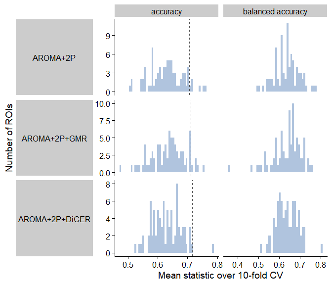<!-- -->

After implementing sample reweighting with 10-fold cross-validation for
SVM using caret, we see that the raw accuracy still has a mean of
approximately 0.68 across all ROIs, although the balanced accuracy has a
mean between 0.5-0.55.

To understand the significance of these values, we can generate a null
distribution of classification accuracies and balanced accuracies using
a model-free shuffle technique, modified from Trent’s theft package.

### 10-fold cross-validated linear SVM with majority class downsampling

``` r
# Try three different noise processing methods
noise_procs = c("AROMA+2P", "AROMA+2P+GMR", "AROMA+2P+DiCER")

# Retain balanced accuracy in addition to raw accuracy for each ROI
use_balanced_accuracy <- TRUE

# Implement inverse probability weighting
use_inv_prob_weighting = FALSE
upsample_minority = FALSE
downsample_majority = TRUE

# Run theft's multivariable classifier on each ROI and save to an RDS object
# If the RDS object doesn't already exist, otherwise load it in
if (!file.exists(paste0(rdata_path, "UCLA_multivar_ROI_res_svmLinear_downsampled.Rds"))) {
  
   region_wise_SVM_caret_downsampled <- run_caret_multi_SVM_by_region(rdata_path = rdata_path,
                                            use_inv_prob_weighting = use_inv_prob_weighting,
                                            upsample_minority = upsample_minority,
                                            downsample_majority = downsample_majority,
                                            noise_procs = noise_procs)  %>%
    dplyr::rename("accuracy" = "Accuracy",
                  "balanced_accuracy" = "Balanced_Accuracy")
   
  saveRDS(region_wise_SVM_caret_downsampled, file=paste0(rdata_path, "UCLA_multivar_ROI_res_svmLinear_downsampled.Rds"))
} else {
  region_wise_SVM_caret_downsampled <- readRDS(paste0(rdata_path, "UCLA_multivar_ROI_res_svmLinear_downsampled.Rds"))
}
```

``` r
plot_class_acc_w_props(class_res = region_wise_SVM_caret_downsampled,
                       rdata_path = rdata_path,
                       noise_procs = noise_procs)
```

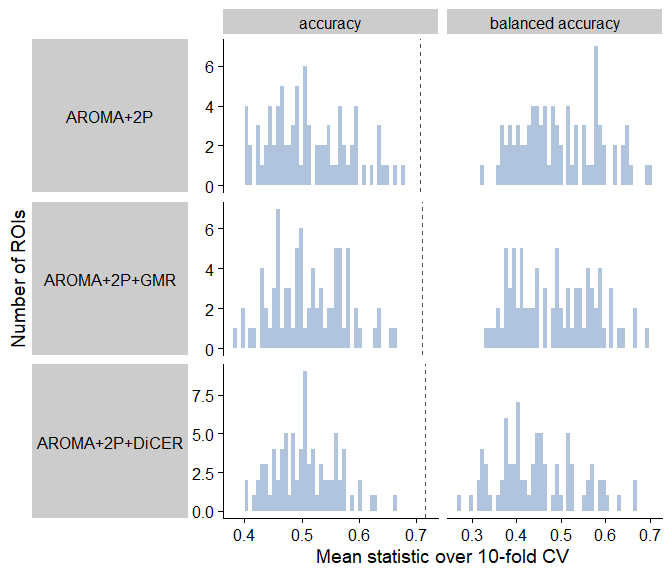<!-- -->

After implementing sample reweighting with 10-fold cross-validation for
SVM using caret, we see that the raw accuracy still has a mean of
approximately 0.68 across all ROIs, although the balanced accuracy has a
mean between 0.5-0.55.

To understand the significance of these values, we can generate a null
distribution of classification accuracies and balanced accuracies using
a model-free shuffle technique, modified from Trent’s theft package.

### Generating null distributions from model-free shuffles

``` r
# Try three different noise processing methods
noise_procs = c("AROMA+2P", "AROMA+2P+GMR", "AROMA+2P+DiCER")

# One without minority upsampling
if (!file.exists(paste0(rdata_path, "Null_Model_Free_Shuffles.Rds"))) {
  set.seed(127) 
  model_free_shuffle_null_res <- run_model_free_n_shuffles(num_shuffles = 1000000,
                                                    rdata_path = rdata_path,
                                                    noise_procs = noise_procs)
  saveRDS(model_free_shuffle_null_res, file = paste0(rdata_path, "Null_Model_Free_Shuffles.Rds"))
} else {
  model_free_shuffle_null_res <- readRDS(paste0(rdata_path, "Null_Model_Free_Shuffles.Rds"))
}

# One with minority upsampling
if (!file.exists(paste0(rdata_path, "Null_Model_Free_Shuffles_Upsampled.Rds"))) {
  set.seed(127) 
  model_free_shuffle_null_upsampled <- run_model_free_n_shuffles(num_shuffles = 1000000,
                                                    rdata_path = rdata_path,
                                                    noise_procs = noise_procs,
                                                    use_upsampling = TRUE)
  saveRDS(model_free_shuffle_null_upsampled, file = paste0(rdata_path, "Null_Model_Free_Shuffles_Upsampled.Rds"))
} else {
  model_free_shuffle_null_upsampled <- readRDS(paste0(rdata_path, "Null_Model_Free_Shuffles_Upsampled.Rds"))
}
```

``` r
region_wise_SVM_caret_upsampled %>%
  dplyr::select(Brain_Region, Noise_Proc, accuracy, balanced_accuracy) %>%
  mutate(Type = "main") %>%
  plyr::rbind.fill(., model_free_shuffle_null_upsampled) %>%
  pivot_longer(cols=c(accuracy, balanced_accuracy),
               names_to = "Metric",
               values_to = "Values") %>%
  mutate(Metric = stringr::str_to_title(str_replace_all(Metric, "_", " "))) %>%
  mutate(Noise_Proc = factor(Noise_Proc, levels = c("AROMA+2P",
                                                    "AROMA+2P+GMR",
                                                    "AROMA+2P+DiCER"))) %>%
  ggplot(data=., mapping=aes(x=Values)) +
  geom_histogram(aes(fill = Type, y=0.5*..density..), 
                 bins = 50,
                 alpha=0.6, position="identity") +
  facet_grid(Noise_Proc ~ Metric, switch="y", scales="free_x") +
  xlab("Value from n=1,000,000 Model-Free Shuffles") +
  ylab("Scaled Density") +
  labs(fill = "Distribution") +
  theme(strip.text.y.left = element_text(angle=0),
        strip.placement = "outside",
        legend.position = "bottom",
        legend.direction = "horizontal") 
```

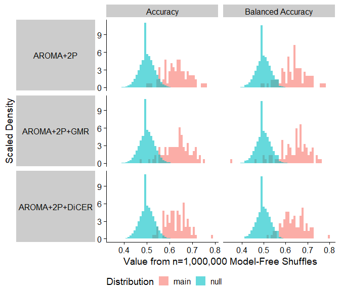<!-- -->

The model-free shuffles method is borrowed from Trent’s implementation
in theft. With this method, the input class labels (Schz or Control) are
randomly shuffled N times, and for each iteration, the classification
accuracy and balanced accuracy is calculated. This yields a null
distribution of accuracies and balanced accuracies, circumventing the
need for running any classification algorithms across iterations.

Here, I’ve run 1,000,000 iterations of the model-free shuffle,
generating 1,000,000 null values for Accuracy and Balanced Accuracy,
respectively. Since this method is independent of brain region, the same
null distribution can be used to compare with each brain region
separately.

I’ve plotted the distribution of null accuracies (coral) alongside the
actual accuracies (teal) for the 82 ROIs on the left.

We can empirically derive p-values for both metrics to see if the
classification accuracy/balanced accuracy is significantly greater than
that in the null distribution.

### Deriving p-values using model-free shuffle null distributions

``` r
if (!file.exists(paste0(rdata_path, "UCLA_region_wise_SVM_caret_upsampled_pvals.Rds"))) {
  region_wise_SVM_caret_upsampled_pvals <- calc_empirical_nulls(class_res = region_wise_SVM_caret_upsampled,
                                                              null_data = model_free_shuffle_null_upsampled,
                                                              by_feature = FALSE)
  saveRDS(region_wise_SVM_caret_upsampled_pvals, file=paste0(rdata_path, "UCLA_region_wise_SVM_caret_upsampled_pvals.Rds"))
} else {
  region_wise_SVM_caret_upsampled_pvals <- readRDS(paste0(rdata_path, "UCLA_region_wise_SVM_caret_upsampled_pvals.Rds"))
}

region_wise_SVM_caret_upsampled_plabs <- region_wise_SVM_caret_upsampled_pvals %>%
  mutate(acc_p = scales::scientific(acc_p, digits = 3),
         bal_acc_p = scales::scientific(bal_acc_p, digits = 3),
         acc_p_adj = scales::scientific(acc_p_adj, digits = 3),
         bal_acc_p_adj = scales::scientific(bal_acc_p_adj, digits = 3))
```

Let’s zoom in on AROMA+2P+DiCER and pick the five brain regions with the
highest cross-validated accuracy:

``` r
brain_regions <- region_wise_SVM_caret_upsampled %>%
  filter(Noise_Proc == "AROMA+2P+DiCER") %>%
  arrange(desc(accuracy)) %>%
  top_n(5, accuracy) %>%
  pull(Brain_Region)
brain_regions
```

    ## [1] "ctx-lh-inferiortemporal"         "ctx-rh-middletemporal"          
    ## [3] "ctx-rh-rostralmiddlefrontal"     "ctx-lh-bankssts"                
    ## [5] "ctx-lh-rostralanteriorcingulate"

``` r
region_wise_SVM_caret_upsampled_pvals %>%
  filter(Noise_Proc == "AROMA+2P+DiCER",
         Brain_Region %in% brain_regions) %>%
  ggplot(data=.) +
  geom_histogram(data = model_free_shuffle_null_upsampled %>% 
                   dplyr::filter(Noise_Proc == "AROMA+2P+DiCER"),
                 aes(x=accuracy, y=0.5*..density..),
                 fill = "gray70", bins=50) +
  ggtitle("Main and Model-Free Shuffle Null Accuracy\nfor top AROMA+2P+DiCER Brain Regions") +
  geom_vline(aes(xintercept = accuracy), color = "red") +
  facet_wrap(Brain_Region ~ ., scales="free_y", nrow = 2) +
  ylab("Scaled Density of Null Iterations") +
  geom_text(data = subset(region_wise_SVM_caret_upsampled_plabs, 
                          Noise_Proc == "AROMA+2P+DiCER" & 
                            Brain_Region %in% brain_regions),
            aes(label = paste0("P = ", acc_p, "\nBH-FDR = ", acc_p_adj)), 
            x = 0.7, y = 9.5) +
  theme(plot.title = element_text(hjust=0.5))
```

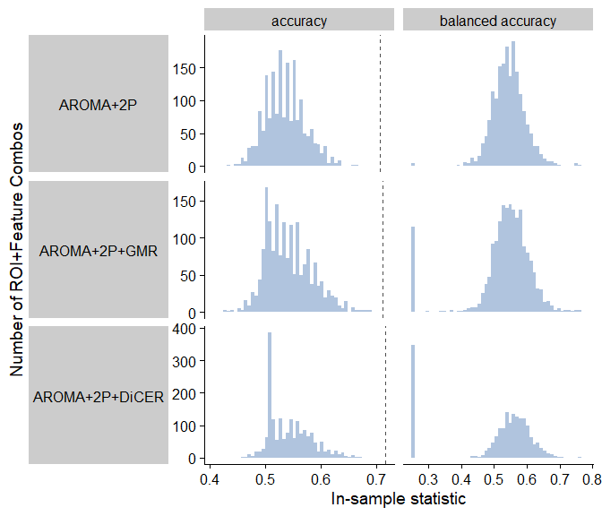<!-- -->

This panel panel shows the five brain regions with the highest raw
accuracy from multi-feature 10-fold CV linear SVM. The red bar indicates
the real accuracy while the gray bars depict the null distribution
(derived from model-free shuffles as shown above).

Even after adjusting for multiple comparisons (82 ROIs x 3
Noise-processing methods) using Benjamini-Hochberg False Discovery Rate
(BH-FDR), the accuracy values for these five regions are still
significant (p \< 1.00e-06, FDR \< 1.00e-05).

We can do the same for balanced accuracy:

``` r
brain_regions <- region_wise_SVM_caret_upsampled %>%
  filter(Noise_Proc == "AROMA+2P+DiCER") %>%
  arrange(desc(balanced_accuracy)) %>%
  top_n(5, balanced_accuracy) %>%
  pull(Brain_Region)
brain_regions
```

    ## [1] "ctx-lh-inferiortemporal"         "ctx-rh-middletemporal"          
    ## [3] "ctx-rh-rostralmiddlefrontal"     "ctx-lh-bankssts"                
    ## [5] "ctx-lh-rostralanteriorcingulate"

``` r
region_wise_SVM_caret_upsampled_pvals %>%
  filter(Noise_Proc == "AROMA+2P+DiCER",
         Brain_Region %in% brain_regions) %>%
  ggplot(data=.) +
  geom_histogram(data = model_free_shuffle_null_upsampled %>% 
                   dplyr::filter(Noise_Proc == "AROMA+2P+DiCER"),
                 aes(x=balanced_accuracy, y=0.5*..density..),
                 fill = "gray70", bins=50) +
  ggtitle("Main and Model-Free Shuffle Null Balanced Accuracy\nfor top AROMA+2P+DiCER Brain Regions") +
  geom_vline(aes(xintercept = balanced_accuracy), color = "red") +
  facet_wrap(Brain_Region ~ ., scales="free_y", nrow = 2) +
  ylab("Scaled Density of Null Iterations") +
  geom_text(data = subset(region_wise_SVM_caret_upsampled_plabs, 
                          Noise_Proc == "AROMA+2P+DiCER" & 
                            Brain_Region %in% brain_regions),
            aes(label = paste0("P = ", bal_acc_p, "\nBH-FDR = ", bal_acc_p_adj)), 
            x = 0.68, y = 7) +
  theme(plot.title = element_text(hjust=0.5))
```

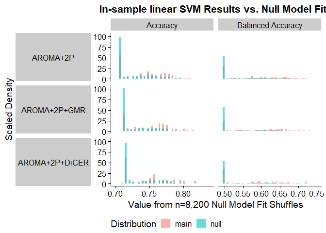<!-- -->

``` r
ggsave("plots/Main_vs_Null_BalAcc_AROMA_2P_DiCER_Top5.png", width=10, 
       height=7, units="in", dpi=300)
```

This panel panel shows the five brain regions with the highest balanced
accuracy from multi-feature 10-fold CV linear SVM. The red bar indicates
the real accuracy while the gray bars depict the null distribution
(derived from model-free shuffles as shown above).

Even after adjusting for multiple comparisons (82 ROIs x 3
Noise-processing methods) using Benjamini-Hochberg False Discovery Rate
(BH-FDR), the accuracy values for these five regions are still
significant (p = 0, BH-FDR = 0).

``` r
region_wise_SVM_caret_upsampled_pvals %>%
  mutate(Noise_Proc = factor(Noise_Proc, levels = noise_procs)) %>%
  group_by(Noise_Proc) %>%
  summarise(num_sig_acc = sum(acc_p < 0.05),
            num_sig_acc_fdr = sum(acc_p_adj < 0.05),
            num_sig_bacc = sum(bal_acc_p < 0.05),
            num_sig_bacc_fdr = sum(bal_acc_p_adj < 0.05))
```

    ## # A tibble: 3 x 5
    ##   Noise_Proc     num_sig_acc num_sig_acc_fdr num_sig_bacc num_sig_bacc_fdr
    ##   <fct>                <int>           <int>        <int>            <int>
    ## 1 AROMA+2P                76              76           75               75
    ## 2 AROMA+2P+GMR            76              76           73               73
    ## 3 AROMA+2P+DiCER          77              77           78               78

This table summarises the number of ROIs for which raw accuracy or
balanced accuracy is significantly greater than the upsampled model-free
shuffle null distribution, both before and after adjusting for multiple
comparisons with BH-FDR.

## Single-feature SVMs

### In-sample Linear SVM for each feature individually

We can run in-sample linear SVM with minority upsampling for each
feature individually.

``` r
noise_procs = c("AROMA+2P", "AROMA+2P+GMR", "AROMA+2P+DiCER")

# Use linear SVM
svm_kernel = "linear"

# Run theft's multivariable classifier on each ROI and save to an RDS object
# If the RDS object doesn't already exist, otherwise load it in
if (!file.exists(paste0(rdata_path, "UCLA_uni_feature_in_sample_linear_SVM_resampled.Rds"))) {
  region_wise_uni_feature_SVM_resampled <- run_in_sample_uni_feature_linear_SVM_by_region(rdata_path = rdata_path,
                                                   svm_kernel = "vanilladot",
                                                   noise_procs = noise_procs,
                                                   use_inv_prob_weighting = FALSE,
                                                   use_resampling = TRUE)
  saveRDS(region_wise_uni_feature_SVM_resampled, file=paste0(rdata_path, "UCLA_uni_feature_in_sample_linear_SVM_resampled.Rds"))
} else {
  region_wise_uni_feature_SVM_resampled <- readRDS(paste0(rdata_path, "UCLA_uni_feature_in_sample_linear_SVM_resampled.Rds"))
}
```

``` r
# Plot accuracy + balanced accuracy in histograms
# Control subject proportion is highlighted for accuracy, 0.5 is highlighted for balanced accuracy
noise_procs = c("AROMA+2P", "AROMA+2P+GMR", "AROMA+2P+DiCER")
plot_class_acc_w_props(class_res = region_wise_uni_feature_SVM_resampled,
                       cv = FALSE,
                       rdata_path = rdata_path,
                       noise_procs = noise_procs,
                       ylab = "Number of ROI+Feature Combos")
```

<!-- -->

``` r
# Save plot
ggsave("plots/In_Sample_Region_Wise_SVM_Uni_Feature_Reweighting.png",
       width=7, height=6, units="in", dpi=300)
```

### 10-fold CV Linear SVM for each feature individually

We can also run the linear SVM with 10-fold cross-validation and inverse
probability weighting for each feature individually.

``` r
# Try three different noise processing methods
noise_procs = c("AROMA+2P", "AROMA+2P+GMR", "AROMA+2P+DiCER")

# Retain balanced accuracy in addition to raw accuracy for each ROI
use_balanced_accuracy <- TRUE

# Implement inverse probability weighting
use_inv_prob_weighting = FALSE
use_resampling = TRUE

# Run theft's multivariable classifier on each ROI and save to an RDS object
# If the RDS object doesn't already exist, otherwise load it in
if (!file.exists(paste0(rdata_path, "UCLA_uni_feature_CV_ROIwise_linear_SVM_resampled.Rds"))) {
  
   region_wise_uni_feat_SVM_CV_resampled <- run_CV_uni_feature_linear_SVM_by_region(rdata_path = rdata_path,
                                            use_inv_prob_weighting = use_inv_prob_weighting,
                                            use_resampling = use_resampling,
                                            noise_procs = noise_procs) %>%
     dplyr::rename("accuracy" = "Accuracy",
                   "balanced_accuracy" = "Balanced_Accuracy")
   saveRDS(region_wise_uni_feat_SVM_CV_resampled, file=paste0(rdata_path, "UCLA_uni_feature_CV_ROIwise_linear_SVM_resampled.Rds"))
} else {
  region_wise_uni_feat_SVM_CV_resampled <- readRDS(paste0(rdata_path, "UCLA_uni_feature_CV_ROIwise_linear_SVM_resampled.Rds"))
}
```

``` r
plot_class_acc_w_props(class_res = region_wise_uni_feat_SVM_CV_resampled,
                       cv = TRUE,
                       rdata_path = rdata_path,
                       noise_procs = noise_procs,
                       ylab = "Number of ROI+Feature Combos")
```

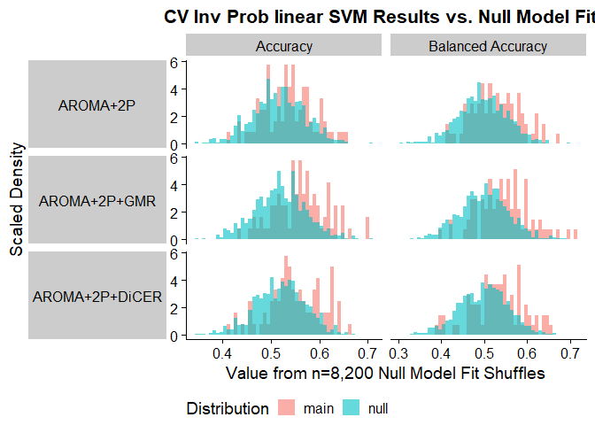<!-- -->

These panels show the results from in-sample (upper) and 10-fold CV
(lower) linear SVM using each catch22 feature separately
(i.e. univariable SVMs) – both of which are using minority class
upsampling. Of note while there are peaks around 0.5 for accuracy and
0.25 for balanced accuracy, there are a good number of feature X ROI
combinations with accuracies and balanced accuracies greater than
change.

### Comparing individual features with resampled null distribution

We can compare the in-sample accuracies and balanced accuracies for
single-feature SVM with the minority upsampled null distribution:

``` r
region_wise_uni_feature_SVM_resampled %>%
  dplyr::select(Brain_Region, Noise_Proc, accuracy, balanced_accuracy) %>%
  mutate(Type = "main") %>%
  plyr::rbind.fill(., model_free_shuffle_null_upsampled) %>%
  pivot_longer(cols=c(accuracy, balanced_accuracy),
               names_to = "Metric",
               values_to = "Values") %>%
  mutate(Metric = stringr::str_to_title(str_replace_all(Metric, "_", " "))) %>%
  mutate(Noise_Proc = factor(Noise_Proc, levels = c("AROMA+2P",
                                                    "AROMA+2P+GMR",
                                                    "AROMA+2P+DiCER"))) %>%
  ggplot(data=., mapping=aes(x=Values)) +
  geom_histogram(aes(fill = Type, y=0.5*..density..), 
                 bins = 50,
                 alpha=0.6, position="identity") +
  facet_grid(Noise_Proc ~ Metric, switch="y", scales="free_x") +
  xlab("Value from n=1,000,000 Model-Free Shuffles") +
  ylab("Scaled Density") +
  labs(fill = "Distribution") +
  theme(strip.text.y.left = element_text(angle=0),
        strip.placement = "outside",
        legend.position = "bottom",
        legend.direction = "horizontal") 
```

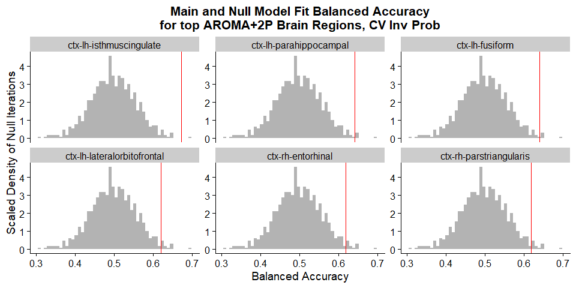<!-- -->

As well as with the 10-fold CV single-feature SVM:

``` r
region_wise_uni_feat_SVM_CV_resampled %>%
  dplyr::select(Brain_Region, Noise_Proc, accuracy, balanced_accuracy) %>%
  mutate(Type = "main") %>%
  plyr::rbind.fill(., model_free_shuffle_null_upsampled) %>%
  pivot_longer(cols=c(accuracy, balanced_accuracy),
               names_to = "Metric",
               values_to = "Values") %>%
  mutate(Metric = stringr::str_to_title(str_replace_all(Metric, "_", " "))) %>%
  mutate(Noise_Proc = factor(Noise_Proc, levels = c("AROMA+2P",
                                                    "AROMA+2P+GMR",
                                                    "AROMA+2P+DiCER"))) %>%
  ggplot(data=., mapping=aes(x=Values)) +
  geom_histogram(aes(fill = Type, y=0.5*..density..), 
                 bins = 50,
                 alpha=0.6, position="identity") +
  facet_grid(Noise_Proc ~ Metric, switch="y", scales="free_x") +
  xlab("Value from n=1,000,000 Model-Free Shuffles") +
  ylab("Scaled Density") +
  labs(fill = "Distribution") +
  theme(strip.text.y.left = element_text(angle=0),
        strip.placement = "outside",
        legend.position = "bottom",
        legend.direction = "horizontal") 
```

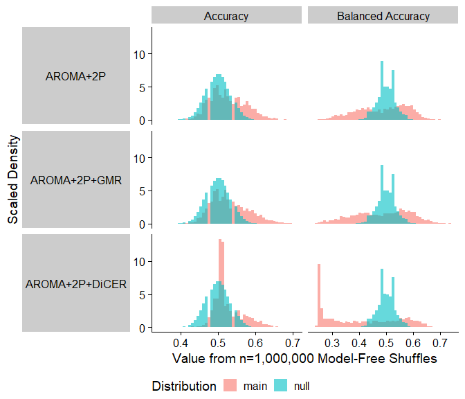<!-- -->

``` r
if (!file.exists(paste0(rdata_path, "UCLA_region_wise_single_feat_SVM_caret_upsampled_pvals.Rds"))) {
  region_wise_single_feat_SVM_caret_upsampled_pvals <- calc_empirical_nulls(class_res = region_wise_uni_feat_SVM_CV_resampled,
                                                              null_data = model_free_shuffle_null_upsampled,
                                                              by_feature = TRUE)
  saveRDS(region_wise_single_feat_SVM_caret_upsampled_pvals, file=paste0(rdata_path, "UCLA_region_wise_single_feat_SVM_caret_upsampled_pvals.Rds"))
} else {
  region_wise_single_feat_SVM_caret_upsampled_pvals <- readRDS(paste0(rdata_path, "UCLA_region_wise_single_feat_SVM_caret_upsampled_pvals.Rds"))
}

region_wise_single_feat_SVM_caret_upsampled_plabs <- region_wise_single_feat_SVM_caret_upsampled_pvals %>%
  mutate(acc_p = scales::scientific(acc_p, digits = 3),
         bal_acc_p = scales::scientific(bal_acc_p, digits = 3),
         acc_p_adj = scales::scientific(acc_p_adj, digits = 3),
         bal_acc_p_adj = scales::scientific(bal_acc_p_adj, digits = 3))
```
