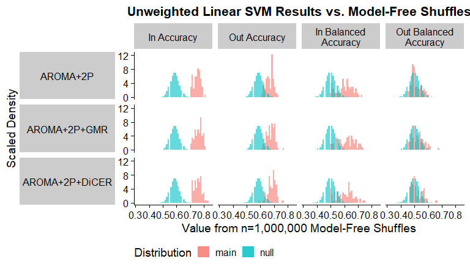
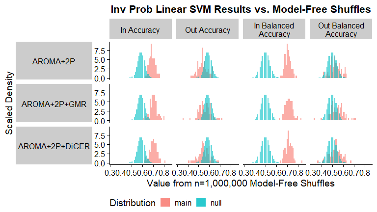
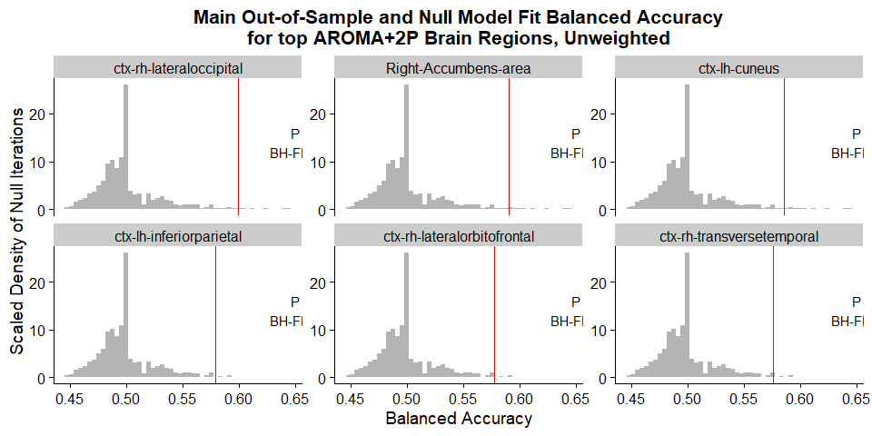
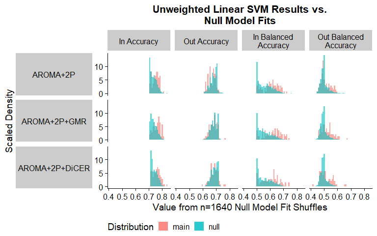
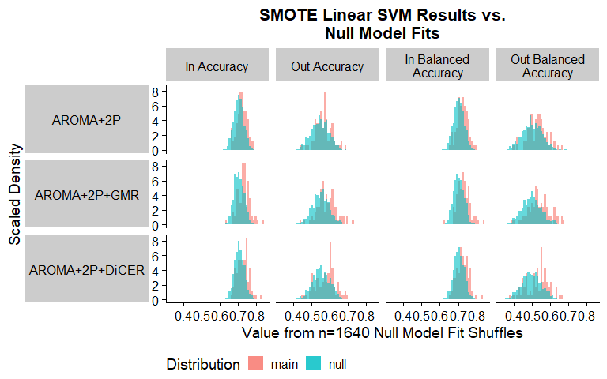

Step 3: ROI-Wise catch22 Feature Analysis
================

### Source functions

## In-sample SVM classification

### Simple in-sample linear SVM

We will start with a simple linear SVM classifier using all 22 features.

<!-- -->

The above figure shows the in-sample results from running `e1071::svm`
using all 22 catch22 features. The dashed line in the accuracy plot
(left) shows the proportion of control subjects for each
noise-processing method, and the dashed line in the balanced accuracy
plot (right) is set at 0.5 – the value when all subjects are classified
as controls.

Clearly, the classification algorithm is biased for the majority of ROIs
to classify all samples as controls in order to achieve a raw accuracy
of \~0.7. Similarly, the balanced accuracy has a clear peak around 0.5.

This highlights the need to mitigate the class imbalances, either with
inverse probability sample reweighting.

### In-sample linear SVM with inverse probability weighting

We can run linear SVM with the `e1071` package to directly test sample
reweighting with in-sample accuracy and balanced accuracy. We will use
inverse probability weighting, meaning that the weight given to a
particular sample in the SVM classifier is inversely proportionate to
the class size to which the sample belongs.

By assigning each subject a weight equivalent to the inverse proportion
of that subject’s diagnosis, the linear SVM places a higher cost on
incorrectly classifying schizophrenia subjects as controls.

<!-- -->

This shifts the raw accuracy down to a mean of 0.68 to 0.7 across the
three noise-processing methods, but the balanced accuracy increases to
have a similar mean range – compared with the majority of values around
0.5 previously.

This indicates that inverse probability reweighting mitigates the class
imbalance issue and can be carried forward into 10-fold cross-validation
linear SVM.

### In-sample linear SVM with SMOTE

We can run linear SVM with the `e1071` package to directly test sample
reweighting with in-sample accuracy and balanced accuracy. We will use
inverse probability weighting, meaning that the weight given to a
particular sample in the SVM classifier is inversely proportionate to
the class size to which the sample belongs.

By assigning each subject a weight equivalent to the inverse proportion
of that subject’s diagnosis, the linear SVM places a higher cost on
incorrectly classifying schizophrenia subjects as controls.

<!-- -->

This shifts the raw accuracy down to a mean of 0.68 to 0.7 across the
three noise-processing methods, but the balanced accuracy increases to
have a similar mean range – compared with the majority of values around
0.5 previously.

This indicates that inverse probability reweighting mitigates the class
imbalance issue and can be carried forward into 10-fold cross-validation
linear SVM.

## Cross-validated SVM classification

### 10-fold cross-validated linear SVM

I have chosen to use 10-fold cross validation via manual implementation,
as the sample reweighting options in caret were limited and difficult to
interpret.

<!-- -->

Interestingly, unlike the in-sample results, there is a fair spread of
accuracy and balanced accuracy values outside of the proportions
expected from classifying all subjects as controls.

However, there still is a balanced accuracy peak around 0.5, so we move
forward with inverse probability reweighting.

### 10-fold cross-validated linear SVM with inverse probability weighting

<!-- -->

As with the in-sample results, the accuracy values are negatively
shifted while the balanced accuracy values are positively shifted after
applying inverse probability reweighting to the samples.

### 10-fold cross-validated linear SVM with SMOTE

sa\[’\]

<!-- -->

As with the in-sample results, the accuracy values are negatively
shifted while the balanced accuracy values are positively shifted after
applying inverse probability reweighting to the samples.

## Model-free shuffle null distribution

### Generating null distributions from model-free shuffles

This first model-free shuffles method is borrowed from Trent’s
implementation in theft. With this method, the input class labels (Schz
or Control) are randomly shuffled N times, and for each iteration, the
classification accuracy and balanced accuracy are calculated. This
yields a null distribution of accuracies and balanced accuracies,
circumventing the need for running any classification algorithms across
iterations.

Here, I’ve run 1,000,000 iterations of the model-free shuffle,
generating 1,000,000 null values for Accuracy and Balanced Accuracy,
respectively. Since this method is independent of brain region, the same
null distribution can be used to compare with each brain region
separately.

### CV linear SVM

<!-- -->

I’ve plotted the distribution of null accuracies (teal) alongside the
actual accuracies (pink) for the 82 ROIs on the left. Let’s zoom in on
AROMA+2P and pick the five brain regions with the highest
cross-validated balanced accuracy:

<!-- -->

<table class="table" style="width: auto !important; margin-left: auto; margin-right: auto;">
<thead>
<tr>
<th style="text-align:left;">
Noise_Proc
</th>
<th style="text-align:right;">
num_sig_acc
</th>
<th style="text-align:right;">
num_sig_acc_fdr
</th>
<th style="text-align:right;">
num_sig_bacc
</th>
<th style="text-align:right;">
num_sig_bacc_fdr
</th>
</tr>
</thead>
<tbody>
<tr>
<td style="text-align:left;">
AROMA+2P
</td>
<td style="text-align:right;">
73
</td>
<td style="text-align:right;">
73
</td>
<td style="text-align:right;">
7
</td>
<td style="text-align:right;">
4
</td>
</tr>
<tr>
<td style="text-align:left;">
AROMA+2P+GMR
</td>
<td style="text-align:right;">
76
</td>
<td style="text-align:right;">
76
</td>
<td style="text-align:right;">
15
</td>
<td style="text-align:right;">
4
</td>
</tr>
<tr>
<td style="text-align:left;">
AROMA+2P+DiCER
</td>
<td style="text-align:right;">
76
</td>
<td style="text-align:right;">
76
</td>
<td style="text-align:right;">
14
</td>
<td style="text-align:right;">
4
</td>
</tr>
</tbody>
</table>

This table summarises the number of ROIs for which raw accuracy or
balanced accuracy is significantly greater than the model-free shuffle
null distribution, both before and after adjusting for multiple
comparisons with BH-FDR.

### CV linear SVM – inv prob

<!-- -->

I’ve plotted the distribution of null accuracies (teal) alongside the
actual accuracies (pink) for the 82 ROIs on the left. Let’s zoom in on
AROMA+2P and pick the five brain regions with the highest
cross-validated balanced accuracy:

<!-- -->

<table class="table" style="width: auto !important; margin-left: auto; margin-right: auto;">
<thead>
<tr>
<th style="text-align:left;">
Noise_Proc
</th>
<th style="text-align:right;">
num_sig_acc
</th>
<th style="text-align:right;">
num_sig_acc_fdr
</th>
<th style="text-align:right;">
num_sig_bacc
</th>
<th style="text-align:right;">
num_sig_bacc_fdr
</th>
</tr>
</thead>
<tbody>
<tr>
<td style="text-align:left;">
AROMA+2P
</td>
<td style="text-align:right;">
1
</td>
<td style="text-align:right;">
0
</td>
<td style="text-align:right;">
18
</td>
<td style="text-align:right;">
15
</td>
</tr>
<tr>
<td style="text-align:left;">
AROMA+2P+GMR
</td>
<td style="text-align:right;">
6
</td>
<td style="text-align:right;">
4
</td>
<td style="text-align:right;">
35
</td>
<td style="text-align:right;">
15
</td>
</tr>
<tr>
<td style="text-align:left;">
AROMA+2P+DiCER
</td>
<td style="text-align:right;">
3
</td>
<td style="text-align:right;">
0
</td>
<td style="text-align:right;">
23
</td>
<td style="text-align:right;">
15
</td>
</tr>
</tbody>
</table>

This table summarises the number of ROIs for which raw accuracy or
balanced accuracy is significantly greater than the model-free shuffle
null distribution, both before and after adjusting for multiple
comparisons with BH-FDR. –

### CV linear SVM – SMOTE

<!-- -->

I’ve plotted the distribution of null accuracies (teal) alongside the
actual accuracies (pink) for the 82 ROIs on the left. Let’s zoom in on
AROMA+2P and pick the five brain regions with the highest
cross-validated balanced accuracy:

<!-- -->

<table class="table" style="width: auto !important; margin-left: auto; margin-right: auto;">
<thead>
<tr>
<th style="text-align:left;">
Noise_Proc
</th>
<th style="text-align:right;">
num_sig_acc
</th>
<th style="text-align:right;">
num_sig_acc_fdr
</th>
<th style="text-align:right;">
num_sig_bacc
</th>
<th style="text-align:right;">
num_sig_bacc_fdr
</th>
</tr>
</thead>
<tbody>
<tr>
<td style="text-align:left;">
AROMA+2P
</td>
<td style="text-align:right;">
2
</td>
<td style="text-align:right;">
1
</td>
<td style="text-align:right;">
19
</td>
<td style="text-align:right;">
4
</td>
</tr>
<tr>
<td style="text-align:left;">
AROMA+2P+GMR
</td>
<td style="text-align:right;">
10
</td>
<td style="text-align:right;">
4
</td>
<td style="text-align:right;">
25
</td>
<td style="text-align:right;">
17
</td>
</tr>
<tr>
<td style="text-align:left;">
AROMA+2P+DiCER
</td>
<td style="text-align:right;">
10
</td>
<td style="text-align:right;">
1
</td>
<td style="text-align:right;">
22
</td>
<td style="text-align:right;">
11
</td>
</tr>
</tbody>
</table>

This table summarises the number of ROIs for which raw accuracy or
balanced accuracy is significantly greater than the model-free shuffle
null distribution, both before and after adjusting for multiple
comparisons with BH-FDR.

## Empirical model-based pooled null distribution

### Generating null distributions from pooled null model fits

In contrast to the model-free shuffle method, here we are actually
shuffling the input class labels right before running the linear SVM
over N=100 iterations per ROI (N=82) and pooling the resulting accuracy
and balanced accuracy values, to generate empirical null distributions
of N=8,200 data points each, respectively.

### In-sample

<!-- -->

The fitted empirical null model distribution is fairly similar to the
real accuracy and balanced accuracy values using in-sample linear SVM
with no reweighting.

<!-- -->

<table class="table" style="width: auto !important; margin-left: auto; margin-right: auto;">
<thead>
<tr>
<th style="text-align:left;">
Noise_Proc
</th>
<th style="text-align:right;">
num_sig_acc
</th>
<th style="text-align:right;">
num_sig_acc_fdr
</th>
<th style="text-align:right;">
num_sig_bacc
</th>
<th style="text-align:right;">
num_sig_bacc_fdr
</th>
</tr>
</thead>
<tbody>
<tr>
<td style="text-align:left;">
AROMA+2P
</td>
<td style="text-align:right;">
8
</td>
<td style="text-align:right;">
0
</td>
<td style="text-align:right;">
15
</td>
<td style="text-align:right;">
0
</td>
</tr>
<tr>
<td style="text-align:left;">
AROMA+2P+GMR
</td>
<td style="text-align:right;">
11
</td>
<td style="text-align:right;">
0
</td>
<td style="text-align:right;">
14
</td>
<td style="text-align:right;">
2
</td>
</tr>
<tr>
<td style="text-align:left;">
AROMA+2P+DiCER
</td>
<td style="text-align:right;">
14
</td>
<td style="text-align:right;">
0
</td>
<td style="text-align:right;">
12
</td>
<td style="text-align:right;">
0
</td>
</tr>
</tbody>
</table>

### In-sample, inverse probability weighted

<!-- -->

The fitted empirical null model distribution is fairly similar to the
real accuracy and balanced accuracy values using in-sample linear SVM
with no reweighting.

<!-- -->

<table class="table" style="width: auto !important; margin-left: auto; margin-right: auto;">
<thead>
<tr>
<th style="text-align:left;">
Noise_Proc
</th>
<th style="text-align:right;">
num_sig_acc
</th>
<th style="text-align:right;">
num_sig_acc_fdr
</th>
<th style="text-align:right;">
num_sig_bacc
</th>
<th style="text-align:right;">
num_sig_bacc_fdr
</th>
</tr>
</thead>
<tbody>
<tr>
<td style="text-align:left;">
AROMA+2P
</td>
<td style="text-align:right;">
6
</td>
<td style="text-align:right;">
0
</td>
<td style="text-align:right;">
10
</td>
<td style="text-align:right;">
0
</td>
</tr>
<tr>
<td style="text-align:left;">
AROMA+2P+GMR
</td>
<td style="text-align:right;">
11
</td>
<td style="text-align:right;">
2
</td>
<td style="text-align:right;">
11
</td>
<td style="text-align:right;">
4
</td>
</tr>
<tr>
<td style="text-align:left;">
AROMA+2P+DiCER
</td>
<td style="text-align:right;">
10
</td>
<td style="text-align:right;">
0
</td>
<td style="text-align:right;">
13
</td>
<td style="text-align:right;">
0
</td>
</tr>
</tbody>
</table>

### CV, inverse probability weighted

<!-- -->

The fitted empirical null model distribution is fairly similar to the
real accuracy and balanced accuracy values using in-sample linear SVM
with no reweighting.

<!-- -->

<table class="table" style="width: auto !important; margin-left: auto; margin-right: auto;">
<thead>
<tr>
<th style="text-align:left;">
Noise_Proc
</th>
<th style="text-align:right;">
num_sig_acc
</th>
<th style="text-align:right;">
num_sig_acc_fdr
</th>
<th style="text-align:right;">
num_sig_bacc
</th>
<th style="text-align:right;">
num_sig_bacc_fdr
</th>
</tr>
</thead>
<tbody>
<tr>
<td style="text-align:left;">
AROMA+2P
</td>
<td style="text-align:right;">
9
</td>
<td style="text-align:right;">
0
</td>
<td style="text-align:right;">
15
</td>
<td style="text-align:right;">
0
</td>
</tr>
<tr>
<td style="text-align:left;">
AROMA+2P+GMR
</td>
<td style="text-align:right;">
13
</td>
<td style="text-align:right;">
4
</td>
<td style="text-align:right;">
14
</td>
<td style="text-align:right;">
2
</td>
</tr>
<tr>
<td style="text-align:left;">
AROMA+2P+DiCER
</td>
<td style="text-align:right;">
14
</td>
<td style="text-align:right;">
0
</td>
<td style="text-align:right;">
14
</td>
<td style="text-align:right;">
0
</td>
</tr>
</tbody>
</table>

### CV, SMOTE

<!-- -->

The fitted empirical null model distribution is fairly similar to the
real accuracy and balanced accuracy values using in-sample linear SVM
with no reweighting.

<!-- -->

<table class="table" style="width: auto !important; margin-left: auto; margin-right: auto;">
<thead>
<tr>
<th style="text-align:left;">
Noise_Proc
</th>
<th style="text-align:right;">
num_sig_acc
</th>
<th style="text-align:right;">
num_sig_acc_fdr
</th>
<th style="text-align:right;">
num_sig_bacc
</th>
<th style="text-align:right;">
num_sig_bacc_fdr
</th>
</tr>
</thead>
<tbody>
<tr>
<td style="text-align:left;">
AROMA+2P
</td>
<td style="text-align:right;">
18
</td>
<td style="text-align:right;">
0
</td>
<td style="text-align:right;">
8
</td>
<td style="text-align:right;">
0
</td>
</tr>
<tr>
<td style="text-align:left;">
AROMA+2P+GMR
</td>
<td style="text-align:right;">
23
</td>
<td style="text-align:right;">
0
</td>
<td style="text-align:right;">
15
</td>
<td style="text-align:right;">
0
</td>
</tr>
<tr>
<td style="text-align:left;">
AROMA+2P+DiCER
</td>
<td style="text-align:right;">
25
</td>
<td style="text-align:right;">
6
</td>
<td style="text-align:right;">
11
</td>
<td style="text-align:right;">
0
</td>
</tr>
</tbody>
</table>

## Comparing left vs. right hemispheres

### 10-fold CV inverse probability weighted

<!-- -->

<!-- -->

## Null model for overall accuracy

### AROMA+2P

Take the average of 82 random accuracy values from the null distribution
10,000x and compare with the mean from AROMA+2P:

<!-- -->

### AROMA+2P with inverse probability weighting

Take the average of 82 random accuracy values from the null distribution
10,000x and compare with the mean from AROMA+2P with inverse probability
weighting:

<!-- -->

### AROMA+2P with SMOTE

Take the average of 82 random accuracy values from the null distribution
10,000x and compare with the mean from AROMA+2P with inverse probability
weighting:

<!-- -->
