Step 4: Feature-wise catch22 ROI Analysis
================

### Source functions

## Feature-wise t-tests

### Full panel histogram visualization

Let’s start with a very simple t-test for catch22 feature values in
control vs schizophrenia subjects by brain region:
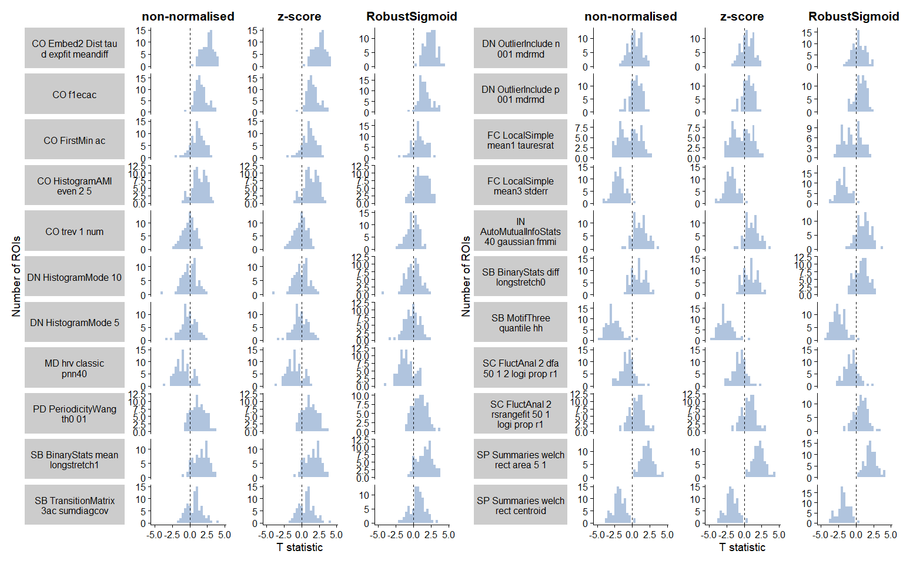<!-- -->

### Top positive and negative feature violin plots

<table class="table" style="width: auto !important; margin-left: auto; margin-right: auto;">
<thead>
<tr>
<th style="text-align:left;">
names
</th>
<th style="text-align:left;">
Brain_Region
</th>
<th style="text-align:right;">
statistic
</th>
</tr>
</thead>
<tbody>
<tr>
<td style="text-align:left;">
CO_Embed2_Dist_tau_d\_expfit_meandiff
</td>
<td style="text-align:left;">
ctx-lh-cuneus
</td>
<td style="text-align:right;">
4.641928
</td>
</tr>
<tr>
<td style="text-align:left;">
CO_Embed2_Dist_tau_d\_expfit_meandiff
</td>
<td style="text-align:left;">
ctx-rh-cuneus
</td>
<td style="text-align:right;">
4.167876
</td>
</tr>
<tr>
<td style="text-align:left;">
CO_Embed2_Dist_tau_d\_expfit_meandiff
</td>
<td style="text-align:left;">
ctx-rh-parstriangularis
</td>
<td style="text-align:right;">
4.126321
</td>
</tr>
<tr>
<td style="text-align:left;">
CO_Embed2_Dist_tau_d\_expfit_meandiff
</td>
<td style="text-align:left;">
ctx-rh-middletemporal
</td>
<td style="text-align:right;">
4.059799
</td>
</tr>
<tr>
<td style="text-align:left;">
CO_Embed2_Dist_tau_d\_expfit_meandiff
</td>
<td style="text-align:left;">
ctx-lh-medialorbitofrontal
</td>
<td style="text-align:right;">
3.994229
</td>
</tr>
<tr>
<td style="text-align:left;">
SB_MotifThree_quantile_hh
</td>
<td style="text-align:left;">
ctx-rh-caudalanteriorcingulate
</td>
<td style="text-align:right;">
-5.071440
</td>
</tr>
<tr>
<td style="text-align:left;">
SB_MotifThree_quantile_hh
</td>
<td style="text-align:left;">
ctx-lh-cuneus
</td>
<td style="text-align:right;">
-4.658858
</td>
</tr>
<tr>
<td style="text-align:left;">
SB_MotifThree_quantile_hh
</td>
<td style="text-align:left;">
ctx-rh-cuneus
</td>
<td style="text-align:right;">
-4.288679
</td>
</tr>
<tr>
<td style="text-align:left;">
SB_MotifThree_quantile_hh
</td>
<td style="text-align:left;">
ctx-rh-lateralorbitofrontal
</td>
<td style="text-align:right;">
-4.054438
</td>
</tr>
<tr>
<td style="text-align:left;">
SB_MotifThree_quantile_hh
</td>
<td style="text-align:left;">
ctx-lh-rostralanteriorcingulate
</td>
<td style="text-align:right;">
-4.004898
</td>
</tr>
</tbody>
</table>

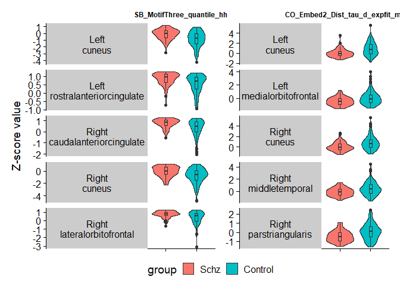<!-- -->

## In-sample SVM classification

### Simple in-sample linear SVM

We will start with a simple linear SVM classifier using all 22 features.

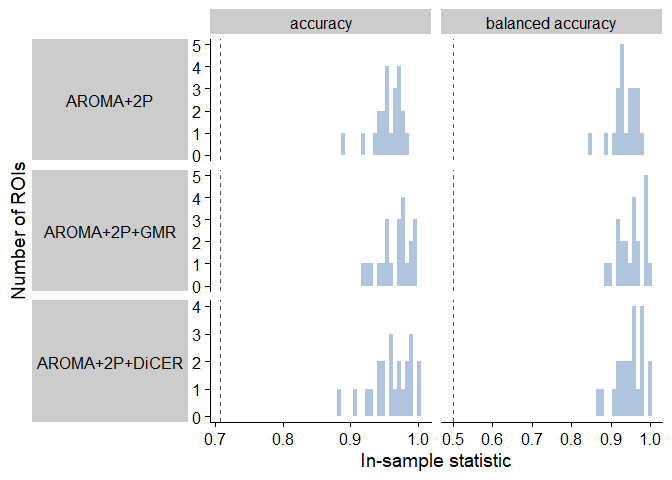<!-- -->

### In-sample linear SVM with inverse probability weighting

We can run linear SVM with the `e1071` package to directly test sample
reweighting with in-sample accuracy and balanced accuracy.

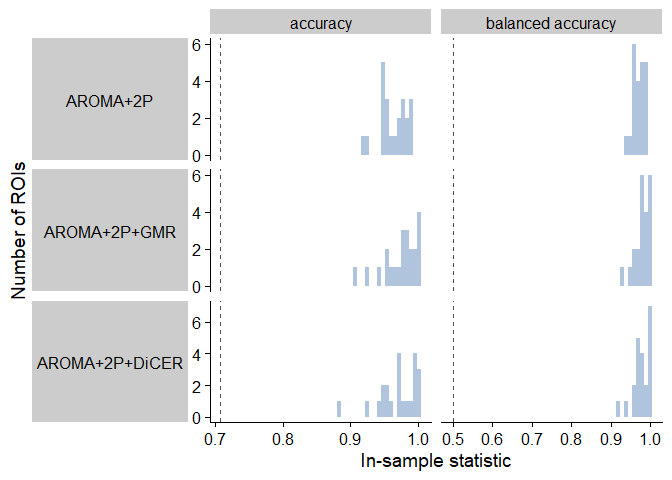<!-- -->

By assigning each subject a weight equivalent to the inverse proportion
of that subject’s diagnosis, the linear SVM places a higher cost on
incorrectly classifying schizophrenia subjects as controls.

This shifts the raw accuracy down to a mean of around 0.68 across the
three noise-processing methods, but the balanced accuracy increases to
have an average of around 0.68 also – compared with almost exclusively
values of 0.35 previously.

This indicates that inverse probability reweighting mitigates the class
imbalance issue and can be carried forward into 10-fold cross-validation
linear SVM.

### In-sample linear SVM with SMOTE

We can run linear SVM with the `e1071` package to directly test sample
reweighting with in-sample accuracy and balanced accuracy.

<!-- -->

By assigning each subject a weight equivalent to the inverse proportion
of that subject’s diagnosis, the linear SVM places a higher cost on
incorrectly classifying schizophrenia subjects as controls.

This shifts the raw accuracy down to a mean of around 0.68 across the
three noise-processing methods, but the balanced accuracy increases to
have an average of around 0.68 also – compared with almost exclusively
values of 0.35 previously.

This indicates that inverse probability reweighting mitigates the class
imbalance issue and can be carried forward into 10-fold cross-validation
linear SVM.

## Cross-validated SVM classification

### 10-fold cross-validated linear SVM

We can implement 10-fold cross-validation (CV) with the `caret` package.

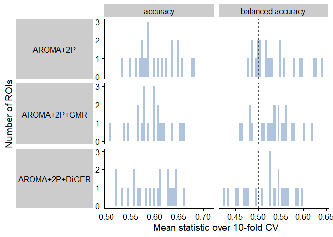<!-- -->

As with in-sample SVM, the unweighted input samples are virtually all
classified as control subjects across all 82 ROIs using the 10-fold
cross-validation linear SVM with caret.

### 10-fold cross-validated linear SVM with inverse probability weighting

<!-- -->

Surprisingly, incorporating inverse probability weighting has minimal
impact when it comes to the ten-fold cross-validated SVM. Of note, the
in-sample and cross-validated SVM were both run with kernlab::ksvm using
default parameters.

### 10-fold cross-validated linear SVM with SMOTE

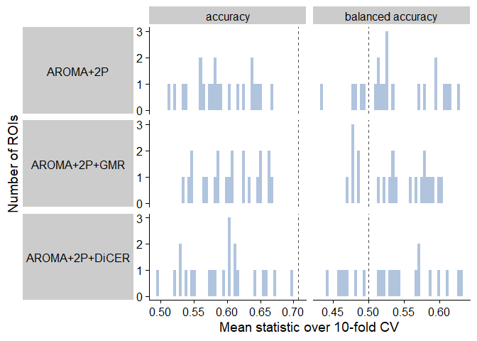<!-- -->

Surprisingly, incorporating inverse probability weighting has minimal
impact when it comes to the ten-fold cross-validated SVM. Of note, the
in-sample and cross-validated SVM were both run with kernlab::ksvm using
default parameters.

## Model-free shuffle null distribution

### Generating null distributions from model-free shuffles

This first model-free shuffles method is borrowed from Trent’s
implementation in theft. With this method, the input class labels (Schz
or Control) are randomly shuffled N times, and for each iteration, the
classification accuracy and balanced accuracy are calculated. This
yields a null distribution of accuracies and balanced accuracies,
circumventing the need for running any classification algorithms across
iterations.

Here, I’ve run 1,000,000 iterations of the model-free shuffle,
generating 1,000,000 null values for Accuracy and Balanced Accuracy,
respectively. Since this method is independent of brain region, the same
null distribution can be used to compare with each brain region
separately.

### CV linear SVM

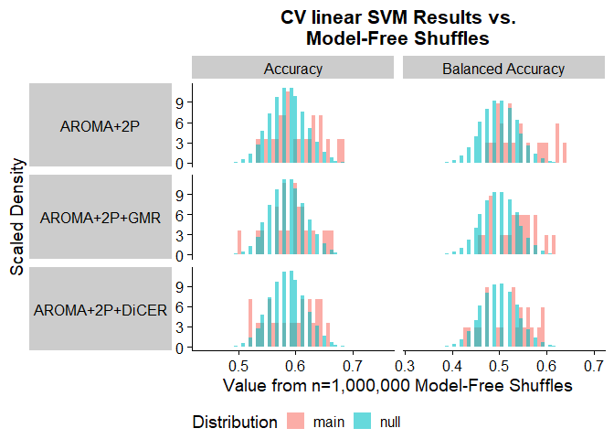<!-- -->

I’ve plotted the distribution of null accuracies (teal) alongside the
actual accuracies (pink) for the 82 ROIs on the left. Let’s zoom in on
AROMA+2P and pick the five catch22 features with the highest
cross-validated balanced accuracy:

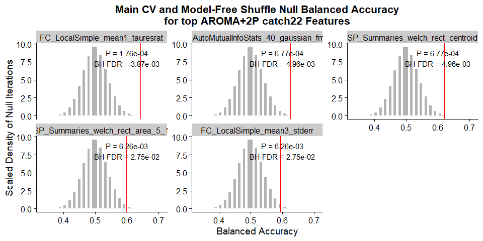<!-- -->

<table class="table" style="width: auto !important; margin-left: auto; margin-right: auto;">
<thead>
<tr>
<th style="text-align:left;">
Noise_Proc
</th>
<th style="text-align:right;">
num_sig_acc
</th>
<th style="text-align:right;">
num_sig_acc_fdr
</th>
<th style="text-align:right;">
num_sig_bacc
</th>
<th style="text-align:right;">
num_sig_bacc_fdr
</th>
</tr>
</thead>
<tbody>
<tr>
<td style="text-align:left;">
AROMA+2P
</td>
<td style="text-align:right;">
5
</td>
<td style="text-align:right;">
2
</td>
<td style="text-align:right;">
6
</td>
<td style="text-align:right;">
5
</td>
</tr>
<tr>
<td style="text-align:left;">
AROMA+2P+GMR
</td>
<td style="text-align:right;">
3
</td>
<td style="text-align:right;">
0
</td>
<td style="text-align:right;">
5
</td>
<td style="text-align:right;">
1
</td>
</tr>
<tr>
<td style="text-align:left;">
AROMA+2P+DiCER
</td>
<td style="text-align:right;">
4
</td>
<td style="text-align:right;">
0
</td>
<td style="text-align:right;">
4
</td>
<td style="text-align:right;">
0
</td>
</tr>
</tbody>
</table>

This table summarises the number of ROIs for which raw accuracy or
balanced accuracy is significantly greater than the model-free shuffle
null distribution, both before and after adjusting for multiple
comparisons with BH-FDR.

### CV linear SVM – inv prob

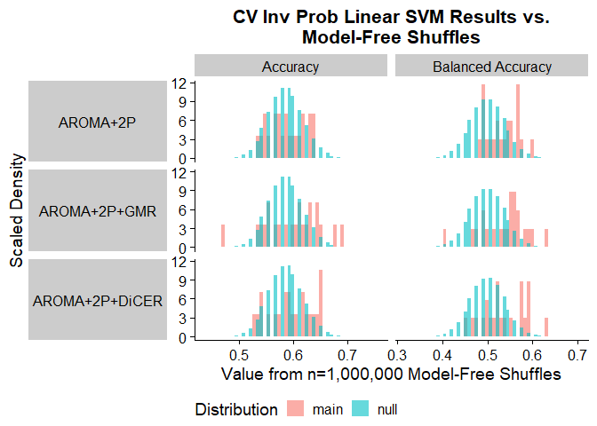<!-- -->

I’ve plotted the distribution of null accuracies (teal) alongside the
actual accuracies (pink) for the 22 catch22 features on the left. Let’s
zoom in on AROMA+2P and pick the five features with the highest
cross-validated balanced accuracy:

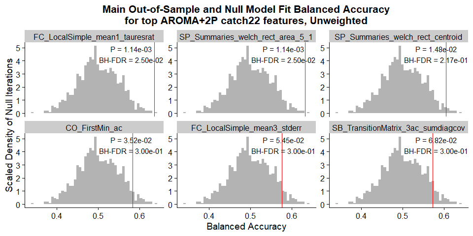<!-- -->

<table class="table" style="width: auto !important; margin-left: auto; margin-right: auto;">
<thead>
<tr>
<th style="text-align:left;">
Noise_Proc
</th>
<th style="text-align:right;">
num_sig_acc
</th>
<th style="text-align:right;">
num_sig_acc_fdr
</th>
<th style="text-align:right;">
num_sig_bacc
</th>
<th style="text-align:right;">
num_sig_bacc_fdr
</th>
</tr>
</thead>
<tbody>
<tr>
<td style="text-align:left;">
AROMA+2P
</td>
<td style="text-align:right;">
2
</td>
<td style="text-align:right;">
0
</td>
<td style="text-align:right;">
6
</td>
<td style="text-align:right;">
0
</td>
</tr>
<tr>
<td style="text-align:left;">
AROMA+2P+GMR
</td>
<td style="text-align:right;">
5
</td>
<td style="text-align:right;">
2
</td>
<td style="text-align:right;">
6
</td>
<td style="text-align:right;">
1
</td>
</tr>
<tr>
<td style="text-align:left;">
AROMA+2P+DiCER
</td>
<td style="text-align:right;">
4
</td>
<td style="text-align:right;">
0
</td>
<td style="text-align:right;">
8
</td>
<td style="text-align:right;">
3
</td>
</tr>
</tbody>
</table>

This table summarises the number of ROIs for which raw accuracy or
balanced accuracy is significantly greater than the model-free shuffle
null distribution, both before and after adjusting for multiple
comparisons with BH-FDR.

### CV linear SVM – SMOTE

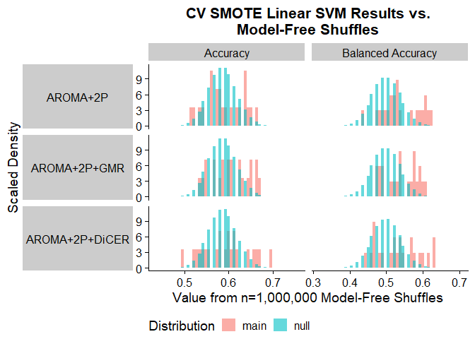<!-- -->

I’ve plotted the distribution of null accuracies (teal) alongside the
actual accuracies (pink) for the 22 catch22 Features on the left. Let’s
zoom in on AROMA+2P and pick the five brain regions with the highest
cross-validated balanced accuracy:

<!-- -->

<table class="table" style="width: auto !important; margin-left: auto; margin-right: auto;">
<thead>
<tr>
<th style="text-align:left;">
Noise_Proc
</th>
<th style="text-align:right;">
num_sig_acc
</th>
<th style="text-align:right;">
num_sig_acc_fdr
</th>
<th style="text-align:right;">
num_sig_bacc
</th>
<th style="text-align:right;">
num_sig_bacc_fdr
</th>
</tr>
</thead>
<tbody>
<tr>
<td style="text-align:left;">
AROMA+2P
</td>
<td style="text-align:right;">
5
</td>
<td style="text-align:right;">
0
</td>
<td style="text-align:right;">
8
</td>
<td style="text-align:right;">
6
</td>
</tr>
<tr>
<td style="text-align:left;">
AROMA+2P+GMR
</td>
<td style="text-align:right;">
6
</td>
<td style="text-align:right;">
3
</td>
<td style="text-align:right;">
9
</td>
<td style="text-align:right;">
7
</td>
</tr>
<tr>
<td style="text-align:left;">
AROMA+2P+DiCER
</td>
<td style="text-align:right;">
5
</td>
<td style="text-align:right;">
3
</td>
<td style="text-align:right;">
8
</td>
<td style="text-align:right;">
4
</td>
</tr>
</tbody>
</table>

This table summarises the number of catch22 features for which raw
accuracy or balanced accuracy is significantly greater than the
model-free shuffle null distribution, both before and after adjusting
for multiple comparisons with BH-FDR.

## Empirical model-based pooled null distribution

### Generating null distributions from pooled null model fits

In contrast to the model-free shuffle method, here we are actually
shuffling the input class labels right before running the linear SVM
over N=40 iterations per feature (N=22) and pooling the resulting
accuracy and balanced accuracy values, to generate empirical null
distributions of N=880 data points each, respectively.

### In-sample

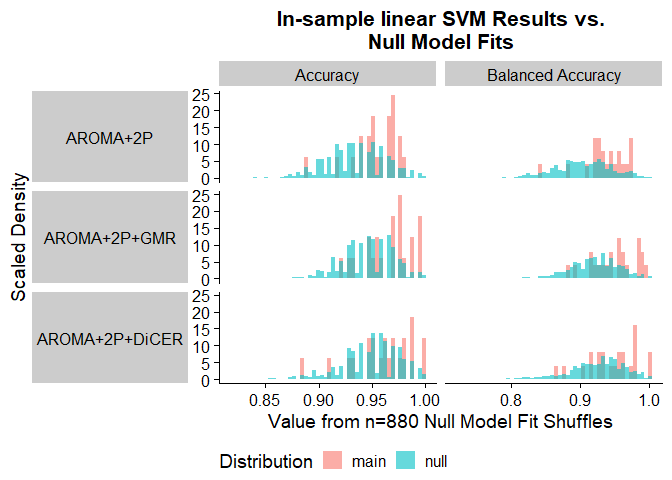<!-- -->

The fitted empirical null model distribution is fairly similar to the
real accuracy and balanced accuracy values using in-sample linear SVM
with no reweighting.

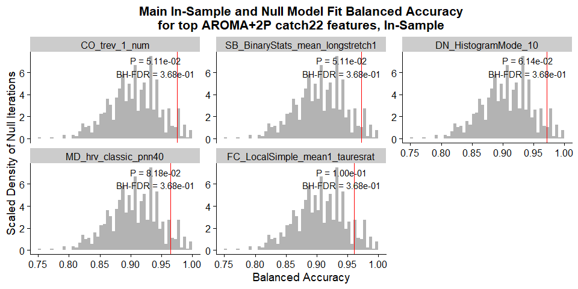<!-- -->

<table class="table" style="width: auto !important; margin-left: auto; margin-right: auto;">
<thead>
<tr>
<th style="text-align:left;">
Noise_Proc
</th>
<th style="text-align:right;">
num_sig_acc
</th>
<th style="text-align:right;">
num_sig_acc_fdr
</th>
<th style="text-align:right;">
num_sig_bacc
</th>
<th style="text-align:right;">
num_sig_bacc_fdr
</th>
</tr>
</thead>
<tbody>
<tr>
<td style="text-align:left;">
AROMA+2P
</td>
<td style="text-align:right;">
0
</td>
<td style="text-align:right;">
0
</td>
<td style="text-align:right;">
0
</td>
<td style="text-align:right;">
0
</td>
</tr>
<tr>
<td style="text-align:left;">
AROMA+2P+GMR
</td>
<td style="text-align:right;">
5
</td>
<td style="text-align:right;">
0
</td>
<td style="text-align:right;">
6
</td>
<td style="text-align:right;">
0
</td>
</tr>
<tr>
<td style="text-align:left;">
AROMA+2P+DiCER
</td>
<td style="text-align:right;">
2
</td>
<td style="text-align:right;">
0
</td>
<td style="text-align:right;">
2
</td>
<td style="text-align:right;">
0
</td>
</tr>
</tbody>
</table>

### In-sample, inverse probability weighted

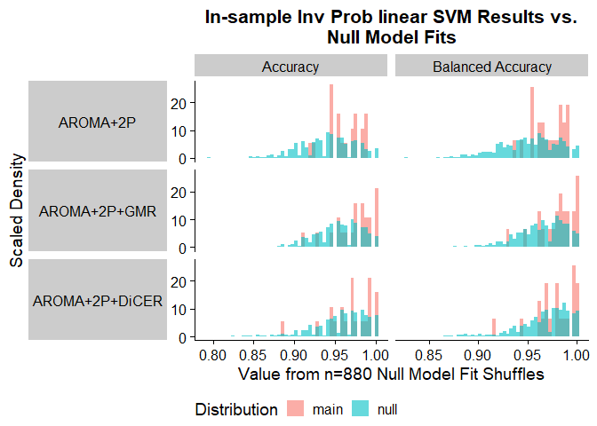<!-- -->

The fitted empirical null model distribution is fairly similar to the
real accuracy and balanced accuracy values using in-sample linear SVM
with no reweighting.

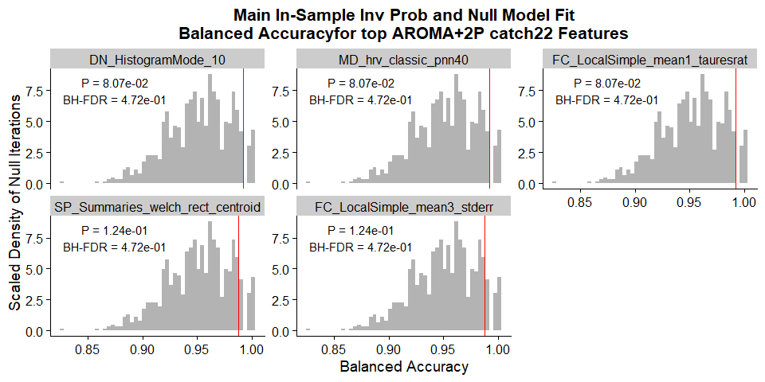<!-- -->

<table class="table" style="width: auto !important; margin-left: auto; margin-right: auto;">
<thead>
<tr>
<th style="text-align:left;">
Noise_Proc
</th>
<th style="text-align:right;">
num_sig_acc
</th>
<th style="text-align:right;">
num_sig_acc_fdr
</th>
<th style="text-align:right;">
num_sig_bacc
</th>
<th style="text-align:right;">
num_sig_bacc_fdr
</th>
</tr>
</thead>
<tbody>
<tr>
<td style="text-align:left;">
AROMA+2P
</td>
<td style="text-align:right;">
0
</td>
<td style="text-align:right;">
0
</td>
<td style="text-align:right;">
0
</td>
<td style="text-align:right;">
0
</td>
</tr>
<tr>
<td style="text-align:left;">
AROMA+2P+GMR
</td>
<td style="text-align:right;">
4
</td>
<td style="text-align:right;">
0
</td>
<td style="text-align:right;">
4
</td>
<td style="text-align:right;">
0
</td>
</tr>
<tr>
<td style="text-align:left;">
AROMA+2P+DiCER
</td>
<td style="text-align:right;">
0
</td>
<td style="text-align:right;">
0
</td>
<td style="text-align:right;">
0
</td>
<td style="text-align:right;">
0
</td>
</tr>
</tbody>
</table>

### CV, inverse probability weighted

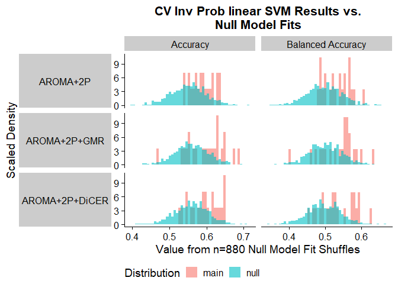<!-- -->

The fitted empirical null model distribution is fairly similar to the
real accuracy and balanced accuracy values using in-sample linear SVM
with no reweighting.

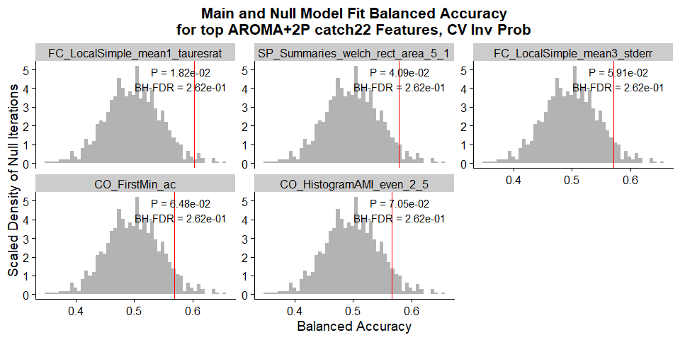<!-- -->

<table class="table" style="width: auto !important; margin-left: auto; margin-right: auto;">
<thead>
<tr>
<th style="text-align:left;">
Noise_Proc
</th>
<th style="text-align:right;">
num_sig_acc
</th>
<th style="text-align:right;">
num_sig_acc_fdr
</th>
<th style="text-align:right;">
num_sig_bacc
</th>
<th style="text-align:right;">
num_sig_bacc_fdr
</th>
</tr>
</thead>
<tbody>
<tr>
<td style="text-align:left;">
AROMA+2P
</td>
<td style="text-align:right;">
3
</td>
<td style="text-align:right;">
0
</td>
<td style="text-align:right;">
2
</td>
<td style="text-align:right;">
0
</td>
</tr>
<tr>
<td style="text-align:left;">
AROMA+2P+GMR
</td>
<td style="text-align:right;">
5
</td>
<td style="text-align:right;">
2
</td>
<td style="text-align:right;">
4
</td>
<td style="text-align:right;">
0
</td>
</tr>
<tr>
<td style="text-align:left;">
AROMA+2P+DiCER
</td>
<td style="text-align:right;">
5
</td>
<td style="text-align:right;">
0
</td>
<td style="text-align:right;">
8
</td>
<td style="text-align:right;">
0
</td>
</tr>
</tbody>
</table>

### CV, SMOTE

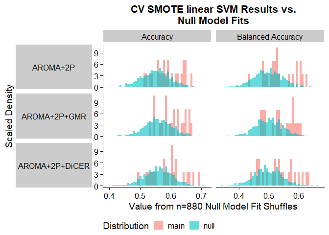<!-- -->

The fitted empirical null model distribution is fairly similar to the
real accuracy and balanced accuracy values using in-sample linear SVM
with no reweighting.

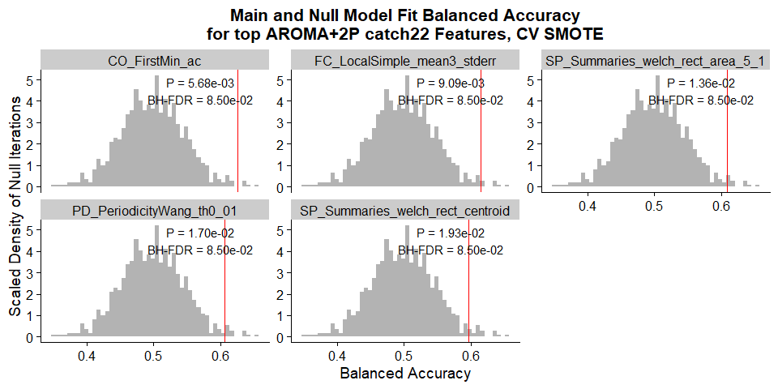<!-- -->

<table class="table" style="width: auto !important; margin-left: auto; margin-right: auto;">
<thead>
<tr>
<th style="text-align:left;">
Noise_Proc
</th>
<th style="text-align:right;">
num_sig_acc
</th>
<th style="text-align:right;">
num_sig_acc_fdr
</th>
<th style="text-align:right;">
num_sig_bacc
</th>
<th style="text-align:right;">
num_sig_bacc_fdr
</th>
</tr>
</thead>
<tbody>
<tr>
<td style="text-align:left;">
AROMA+2P
</td>
<td style="text-align:right;">
6
</td>
<td style="text-align:right;">
0
</td>
<td style="text-align:right;">
7
</td>
<td style="text-align:right;">
0
</td>
</tr>
<tr>
<td style="text-align:left;">
AROMA+2P+GMR
</td>
<td style="text-align:right;">
6
</td>
<td style="text-align:right;">
0
</td>
<td style="text-align:right;">
7
</td>
<td style="text-align:right;">
0
</td>
</tr>
<tr>
<td style="text-align:left;">
AROMA+2P+DiCER
</td>
<td style="text-align:right;">
5
</td>
<td style="text-align:right;">
0
</td>
<td style="text-align:right;">
6
</td>
<td style="text-align:right;">
2
</td>
</tr>
</tbody>
</table>

## Comparing model-free shuffle with pooled empirical null distributions

<!-- -->
