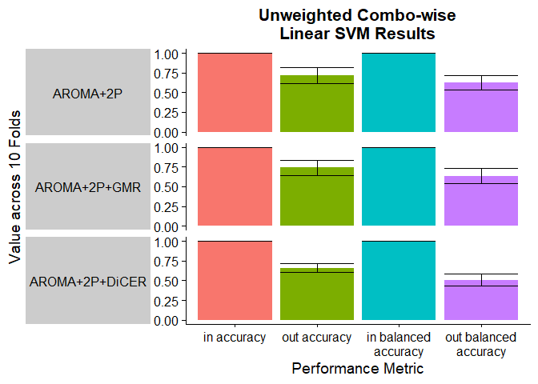
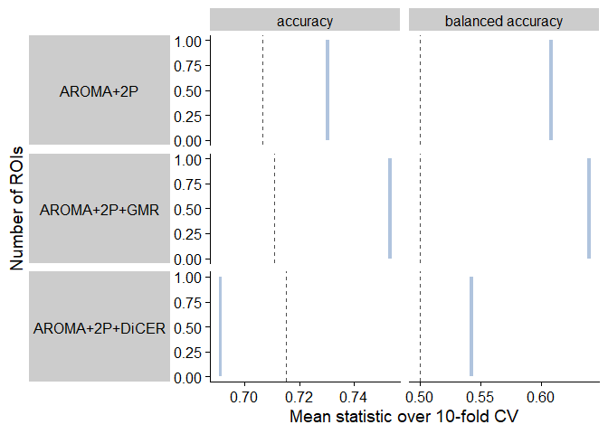
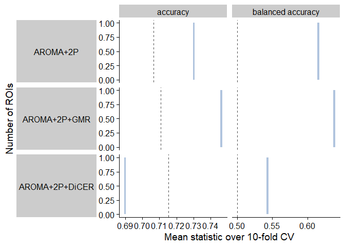
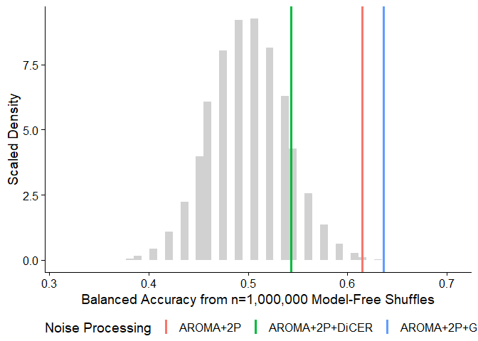
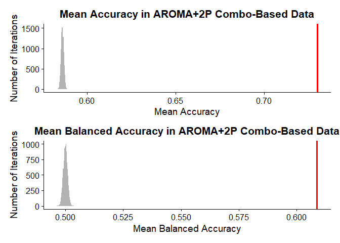
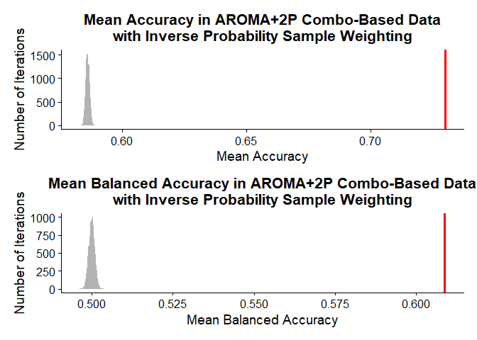
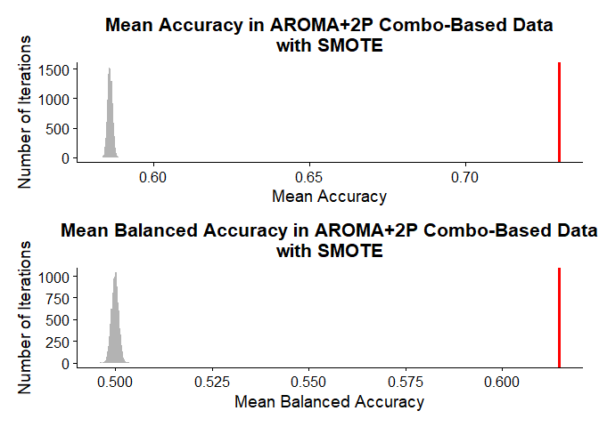

Step 5: ROI+Feature Classification Analysis
================

### Source functions

## In-sample SVM classification

### Simple in-sample linear SVM

We will start with a simple linear SVM classifier using all 22 features.

<!-- -->

### In-sample linear SVM with inverse probability weighting

We can run linear SVM with the `e1071` package to directly test sample
reweighting with in-sample accuracy and balanced accuracy.

<!-- -->

By assigning each subject a weight equivalent to the inverse proportion
of that subject’s diagnosis, the linear SVM places a higher cost on
incorrectly classifying schizophrenia subjects as controls.

This shifts the raw accuracy down to a mean of around 0.68 across the
three noise-processing methods, but the balanced accuracy increases to
have an average of around 0.68 also – compared with almost exclusively
values of 0.35 previously.

This indicates that inverse probability reweighting mitigates the class
imbalance issue and can be carried forward into 10-fold cross-validation
linear SVM.

### In-sample linear SVM with SMOTE

We can run linear SVM with the `e1071` package to directly test SMOTE
with in-sample accuracy and balanced accuracy.

<!-- -->

By assigning each subject a weight equivalent to the inverse proportion
of that subject’s diagnosis, the linear SVM places a higher cost on
incorrectly classifying schizophrenia subjects as controls.

This shifts the raw accuracy down to a mean of around 0.68 across the
three noise-processing methods, but the balanced accuracy increases to
have an average of around 0.68 also – compared with almost exclusively
values of 0.35 previously.

This indicates that inverse probability reweighting mitigates the class
imbalance issue and can be carried forward into 10-fold cross-validation
linear SVM.

## Cross-validated SVM classification

### 10-fold cross-validated linear SVM

We can implement 10-fold cross-validation (CV) with the `caret` package.

<!-- -->

As with in-sample SVM, the unweighted input samples are virtually all
classified as control subjects across all 82 ROIs using the 10-fold
cross-validation linear SVM with caret.

### 10-fold cross-validated linear SVM with inverse probability weighting

<!-- -->

Surprisingly, incorporating inverse probability weighting has minimal
impact when it comes to the ten-fold cross-validated SVM. Of note, the
in-sample and cross-validated SVM were both run with kernlab::ksvm using
default parameters.

### 10-fold cross-validated linear SVM with SMOTE

<!-- -->

Surprisingly, incorporating inverse probability weighting has minimal
impact when it comes to the ten-fold cross-validated SVM. Of note, the
in-sample and cross-validated SVM were both run with kernlab::ksvm using
default parameters.

## Null models

### Generating null distributions from model-free shuffles

### Deriving p-values using model-free shuffle null distributions

Balanced accuracy:
<!-- -->

Summary statistics:
<table class="table" style="width: auto !important; margin-left: auto; margin-right: auto;">
<thead>
<tr>
<th style="text-align:left;">
Noise_Proc
</th>
<th style="text-align:right;">
accuracy
</th>
<th style="text-align:right;">
balanced_accuracy
</th>
<th style="text-align:left;">
acc_p
</th>
<th style="text-align:left;">
bal_acc_p
</th>
<th style="text-align:left;">
acc_p\_adj
</th>
<th style="text-align:left;">
bal_acc_p\_adj
</th>
</tr>
</thead>
<tbody>
<tr>
<td style="text-align:left;">
AROMA+2P
</td>
<td style="text-align:right;">
0.7297794
</td>
<td style="text-align:right;">
0.6088636
</td>
<td style="text-align:left;">
1.4e-05
</td>
<td style="text-align:left;">
2.2e-03
</td>
<td style="text-align:left;">
1.4e-05
</td>
<td style="text-align:left;">
2.2e-03
</td>
</tr>
<tr>
<td style="text-align:left;">
AROMA+2P+GMR
</td>
<td style="text-align:right;">
0.7525735
</td>
<td style="text-align:right;">
0.6406061
</td>
<td style="text-align:left;">
1e-06
</td>
<td style="text-align:left;">
1.68e-04
</td>
<td style="text-align:left;">
1e-06
</td>
<td style="text-align:left;">
1.68e-04
</td>
</tr>
<tr>
<td style="text-align:left;">
AROMA+2P+DiCER
</td>
<td style="text-align:right;">
0.6904412
</td>
<td style="text-align:right;">
0.5430303
</td>
<td style="text-align:left;">
6.76e-04
</td>
<td style="text-align:left;">
1.44e-01
</td>
<td style="text-align:left;">
6.76e-04
</td>
<td style="text-align:left;">
1.44e-01
</td>
</tr>
</tbody>
</table>

### Deriving p-values using model-free shuffle null distributions – CV inv prob

Balanced accuracy:
<!-- -->

Summary statistics:
<table class="table" style="width: auto !important; margin-left: auto; margin-right: auto;">
<thead>
<tr>
<th style="text-align:left;">
Noise_Proc
</th>
<th style="text-align:right;">
accuracy
</th>
<th style="text-align:right;">
balanced_accuracy
</th>
<th style="text-align:left;">
acc_p
</th>
<th style="text-align:left;">
bal_acc_p
</th>
<th style="text-align:left;">
acc_p\_adj
</th>
<th style="text-align:left;">
bal_acc_p\_adj
</th>
</tr>
</thead>
<tbody>
<tr>
<td style="text-align:left;">
AROMA+2P
</td>
<td style="text-align:right;">
0.7297794
</td>
<td style="text-align:right;">
0.6088636
</td>
<td style="text-align:left;">
1.4e-05
</td>
<td style="text-align:left;">
2.2e-03
</td>
<td style="text-align:left;">
1.4e-05
</td>
<td style="text-align:left;">
2.2e-03
</td>
</tr>
<tr>
<td style="text-align:left;">
AROMA+2P+GMR
</td>
<td style="text-align:right;">
0.7525735
</td>
<td style="text-align:right;">
0.6406061
</td>
<td style="text-align:left;">
1e-06
</td>
<td style="text-align:left;">
1.68e-04
</td>
<td style="text-align:left;">
1e-06
</td>
<td style="text-align:left;">
1.68e-04
</td>
</tr>
<tr>
<td style="text-align:left;">
AROMA+2P+DiCER
</td>
<td style="text-align:right;">
0.6904412
</td>
<td style="text-align:right;">
0.5430303
</td>
<td style="text-align:left;">
6.76e-04
</td>
<td style="text-align:left;">
1.44e-01
</td>
<td style="text-align:left;">
6.76e-04
</td>
<td style="text-align:left;">
1.44e-01
</td>
</tr>
</tbody>
</table>

### Deriving p-values using model-free shuffle null distributions – CV SMOTE

Balanced accuracy:
<!-- -->

Summary statistics:
<table class="table" style="width: auto !important; margin-left: auto; margin-right: auto;">
<thead>
<tr>
<th style="text-align:left;">
Noise_Proc
</th>
<th style="text-align:right;">
accuracy
</th>
<th style="text-align:right;">
balanced_accuracy
</th>
<th style="text-align:left;">
acc_p
</th>
<th style="text-align:left;">
bal_acc_p
</th>
<th style="text-align:left;">
acc_p\_adj
</th>
<th style="text-align:left;">
bal_acc_p\_adj
</th>
</tr>
</thead>
<tbody>
<tr>
<td style="text-align:left;">
AROMA+2P
</td>
<td style="text-align:right;">
0.7297794
</td>
<td style="text-align:right;">
0.6146970
</td>
<td style="text-align:left;">
1.4e-05
</td>
<td style="text-align:left;">
2.2e-03
</td>
<td style="text-align:left;">
1.4e-05
</td>
<td style="text-align:left;">
2.2e-03
</td>
</tr>
<tr>
<td style="text-align:left;">
AROMA+2P+GMR
</td>
<td style="text-align:right;">
0.7466912
</td>
<td style="text-align:right;">
0.6364394
</td>
<td style="text-align:left;">
1e-06
</td>
<td style="text-align:left;">
1.68e-04
</td>
<td style="text-align:left;">
1e-06
</td>
<td style="text-align:left;">
1.68e-04
</td>
</tr>
<tr>
<td style="text-align:left;">
AROMA+2P+DiCER
</td>
<td style="text-align:right;">
0.6904412
</td>
<td style="text-align:right;">
0.5430303
</td>
<td style="text-align:left;">
6.76e-04
</td>
<td style="text-align:left;">
1.44e-01
</td>
<td style="text-align:left;">
6.76e-04
</td>
<td style="text-align:left;">
1.44e-01
</td>
</tr>
</tbody>
</table>

## Null model for overall accuracy

### AROMA+2P

Take the average of 1804 random accuracy values from the null
distribution 10,000x and compare with the mean from AROMA+2P:

<!-- -->

### AROMA+2P with inverse probability weighting

Take the average of 22 random accuracy values from the null distribution
10,000x and compare with the mean from AROMA+2P with inverse probability
weighting:

<!-- -->

### AROMA+2P with SMOTE

Take the average of 1,804 random accuracy values from the null
distribution 10,000x and compare with the mean from AROMA+2P with
inverse probability weighting:

<!-- -->
