Step 5: ROI+Feature Classification Analysis
================

### Source functions

## In-sample SVM classification

### Simple in-sample linear SVM

We will start with a simple linear SVM classifier using all 22 features.

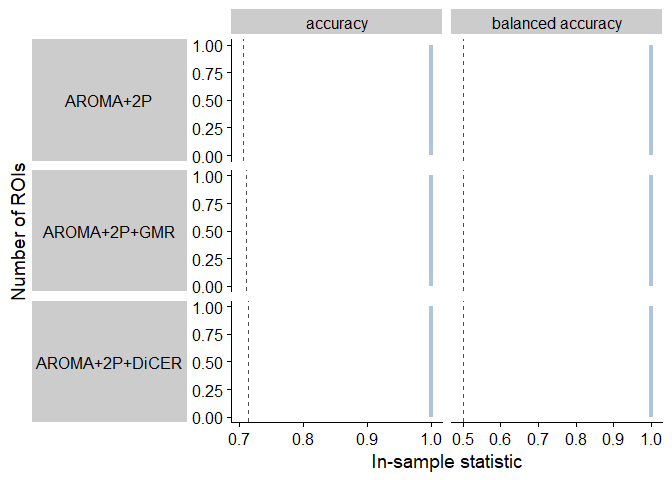<!-- -->

### In-sample linear SVM with inverse probability weighting

We can run linear SVM with the `e1071` package to directly test sample
reweighting with in-sample accuracy and balanced accuracy.

<!-- -->

By assigning each subject a weight equivalent to the inverse proportion
of that subject’s diagnosis, the linear SVM places a higher cost on
incorrectly classifying schizophrenia subjects as controls.

This shifts the raw accuracy down to a mean of around 0.68 across the
three noise-processing methods, but the balanced accuracy increases to
have an average of around 0.68 also – compared with almost exclusively
values of 0.35 previously.

This indicates that inverse probability reweighting mitigates the class
imbalance issue and can be carried forward into 10-fold cross-validation
linear SVM.

### In-sample linear SVM with SMOTE

We can run linear SVM with the `e1071` package to directly test SMOTE
with in-sample accuracy and balanced accuracy.

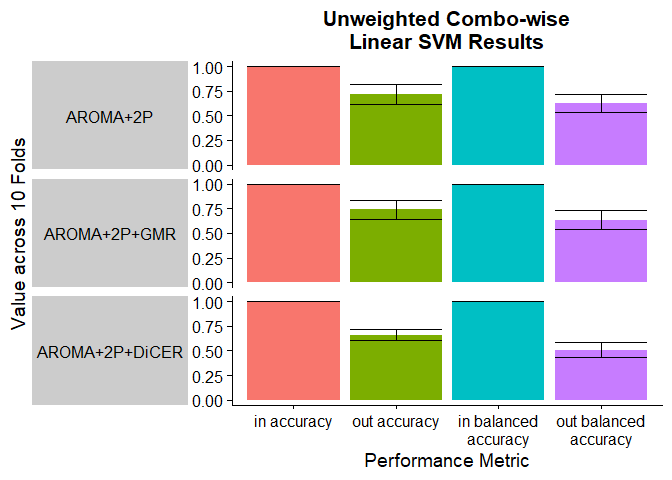<!-- -->

By assigning each subject a weight equivalent to the inverse proportion
of that subject’s diagnosis, the linear SVM places a higher cost on
incorrectly classifying schizophrenia subjects as controls.

This shifts the raw accuracy down to a mean of around 0.68 across the
three noise-processing methods, but the balanced accuracy increases to
have an average of around 0.68 also – compared with almost exclusively
values of 0.35 previously.

This indicates that inverse probability reweighting mitigates the class
imbalance issue and can be carried forward into 10-fold cross-validation
linear SVM.

## Cross-validated SVM classification

### 10-fold cross-validated linear SVM

We can implement 10-fold cross-validation (CV) with the `caret` package.

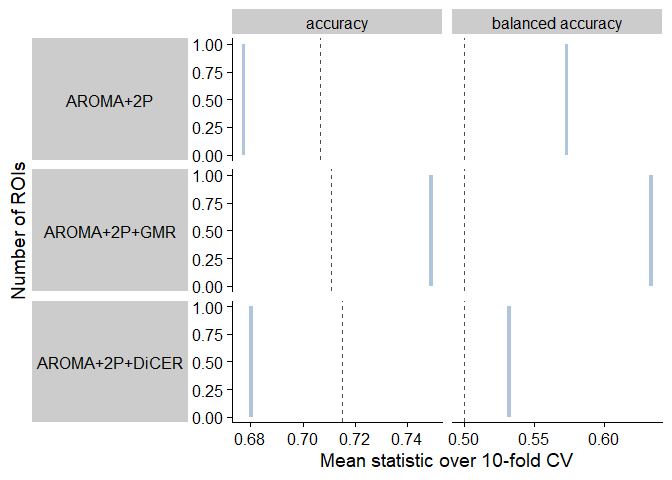<!-- -->

As with in-sample SVM, the unweighted input samples are virtually all
classified as control subjects across all 82 ROIs using the 10-fold
cross-validation linear SVM with caret.

### 10-fold cross-validated linear SVM with inverse probability weighting

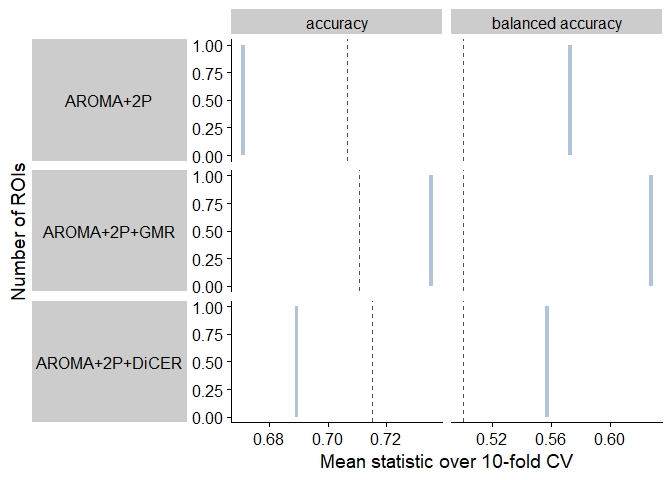<!-- -->

Surprisingly, incorporating inverse probability weighting has minimal
impact when it comes to the ten-fold cross-validated SVM. Of note, the
in-sample and cross-validated SVM were both run with kernlab::ksvm using
default parameters.

### 10-fold cross-validated linear SVM with SMOTE

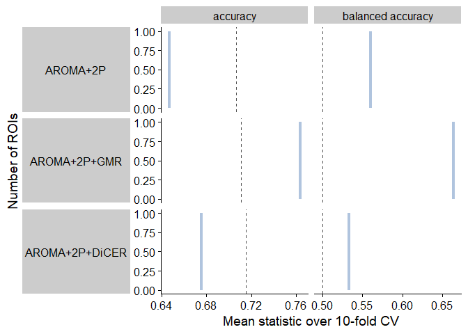<!-- -->

Surprisingly, incorporating inverse probability weighting has minimal
impact when it comes to the ten-fold cross-validated SVM. Of note, the
in-sample and cross-validated SVM were both run with kernlab::ksvm using
default parameters.

## Model-free shuffle null distribution

### Generating null distributions from model-free shuffles

This first model-free shuffles method is borrowed from Trent’s
implementation in theft. With this method, the input class labels (Schz
or Control) are randomly shuffled N times, and for each iteration, the
classification accuracy and balanced accuracy are calculated. This
yields a null distribution of accuracies and balanced accuracies,
circumventing the need for running any classification algorithms across
iterations.

Here, I’ve run 1,000,000 iterations of the model-free shuffle,
generating 1,000,000 null values for Accuracy and Balanced Accuracy,
respectively. Since this method is independent of ROI/feature combo, the
same null distribution can be used to compare with each ROI/feature
combo separately.

### CV linear SVM

I’ve plotted the distribution of null accuracies (gray) alongside the
actual accuracies (green, red, and blue) for the ROI/Feature combos per
noise-processing method.

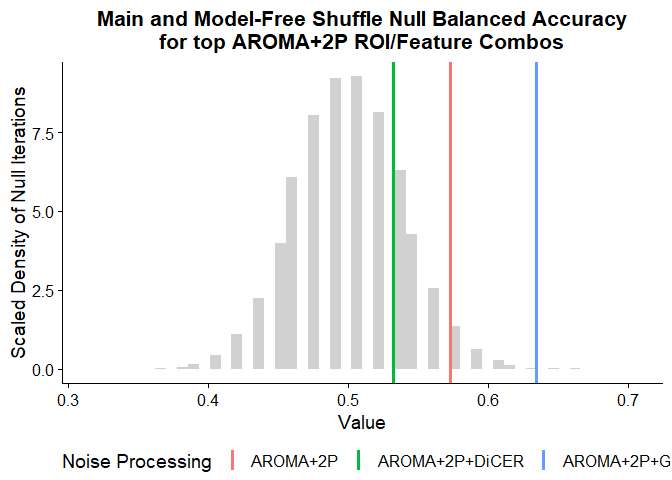<!-- -->

<table class="table" style="width: auto !important; margin-left: auto; margin-right: auto;">
<thead>
<tr>
<th style="text-align:left;">
Noise_Proc
</th>
<th style="text-align:right;">
balanced_accuracy
</th>
<th style="text-align:left;">
bal_acc_p
</th>
</tr>
</thead>
<tbody>
<tr>
<td style="text-align:left;font-weight: bold;color: black !important;background-color: palegreen !important;">
AROMA+2P
</td>
<td style="text-align:right;font-weight: bold;color: black !important;background-color: palegreen !important;">
0.5726515
</td>
<td style="text-align:left;font-weight: bold;color: black !important;background-color: palegreen !important;">
3.71e-02
</td>
</tr>
<tr>
<td style="text-align:left;">
AROMA+2P+GMR
</td>
<td style="text-align:right;">
0.6337879
</td>
<td style="text-align:left;">
1.68e-04
</td>
</tr>
<tr>
<td style="text-align:left;font-weight: bold;color: black !important;background-color: palegreen !important;">
AROMA+2P+DiCER
</td>
<td style="text-align:right;font-weight: bold;color: black !important;background-color: palegreen !important;">
0.5317424
</td>
<td style="text-align:left;font-weight: bold;color: black !important;background-color: palegreen !important;">
2.42e-01
</td>
</tr>
</tbody>
</table>

This table summarises the number of ROIs for which raw accuracy or
balanced accuracy is significantly greater than the model-free shuffle
null distribution, both before and after adjusting for multiple
comparisons with BH-FDR.

### CV linear SVM – inv prob

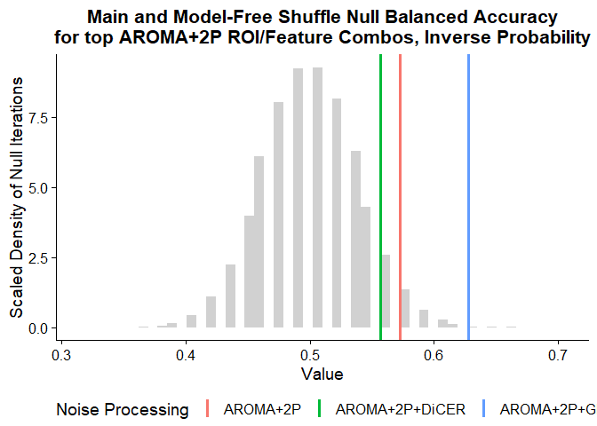<!-- -->

I’ve plotted the distribution of null accuracies (gray) alongside the
actual accuracies (green, red, and blue) for the ROI/Feature combos per
noise-processing method.

<table class="table" style="width: auto !important; margin-left: auto; margin-right: auto;">
<thead>
<tr>
<th style="text-align:left;">
Noise_Proc
</th>
<th style="text-align:right;">
balanced_accuracy
</th>
<th style="text-align:left;">
bal_acc_p
</th>
</tr>
</thead>
<tbody>
<tr>
<td style="text-align:left;font-weight: bold;color: black !important;background-color: palegreen !important;">
AROMA+2P
</td>
<td style="text-align:right;font-weight: bold;color: black !important;background-color: palegreen !important;">
0.5721970
</td>
<td style="text-align:left;font-weight: bold;color: black !important;background-color: palegreen !important;">
3.71e-02
</td>
</tr>
<tr>
<td style="text-align:left;">
AROMA+2P+GMR
</td>
<td style="text-align:right;">
0.6276515
</td>
<td style="text-align:left;">
6.37e-04
</td>
</tr>
<tr>
<td style="text-align:left;font-weight: bold;color: black !important;background-color: palegreen !important;">
AROMA+2P+DiCER
</td>
<td style="text-align:right;font-weight: bold;color: black !important;background-color: palegreen !important;">
0.5564394
</td>
<td style="text-align:left;font-weight: bold;color: black !important;background-color: palegreen !important;">
7.71e-02
</td>
</tr>
</tbody>
</table>

This table summarises the number of ROIs for which raw accuracy or
balanced accuracy is significantly greater than the model-free shuffle
null distribution, both before and after adjusting for multiple
comparisons with BH-FDR.

### CV linear SVM – SMOTE

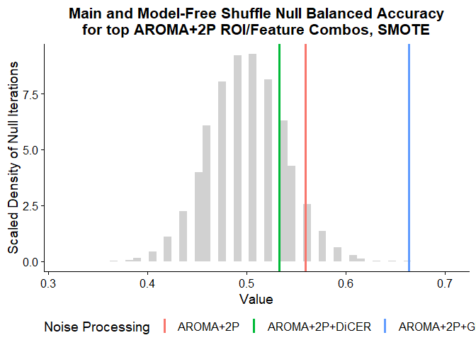<!-- -->

I’ve plotted the distribution of null accuracies (gray) alongside the
actual accuracies (green, red, and blue) for the ROI/Feature combos per
noise-processing method.

<table class="table" style="width: auto !important; margin-left: auto; margin-right: auto;">
<thead>
<tr>
<th style="text-align:left;">
Noise_Proc
</th>
<th style="text-align:right;">
balanced_accuracy
</th>
<th style="text-align:left;">
bal_acc_p
</th>
</tr>
</thead>
<tbody>
<tr>
<td style="text-align:left;">
AROMA+2P
</td>
<td style="text-align:right;">
0.5588636
</td>
<td style="text-align:left;">
7.73e-02
</td>
</tr>
<tr>
<td style="text-align:left;">
AROMA+2P+GMR
</td>
<td style="text-align:right;">
0.6634091
</td>
<td style="text-align:left;">
5e-06
</td>
</tr>
<tr>
<td style="text-align:left;font-weight: bold;color: black !important;background-color: palegreen !important;">
AROMA+2P+DiCER
</td>
<td style="text-align:right;font-weight: bold;color: black !important;background-color: palegreen !important;">
0.5325758
</td>
<td style="text-align:left;font-weight: bold;color: black !important;background-color: palegreen !important;">
2.42e-01
</td>
</tr>
</tbody>
</table>

This table summarises the number of ROIs for which raw accuracy or
balanced accuracy is significantly greater than the model-free shuffle
null distribution, both before and after adjusting for multiple
comparisons with BH-FDR.

## Empirical model-based pooled null distribution

### Generating null distributions from pooled null model fits

In contrast to the model-free shuffle method, here we are actually
shuffling the input class labels right before running the linear SVM
over N=100 iterations per ROI (N=82) and pooling the resulting accuracy
and balanced accuracy values, to generate empirical null distributions
of N=1,000 data points each, respectively.

### In-sample

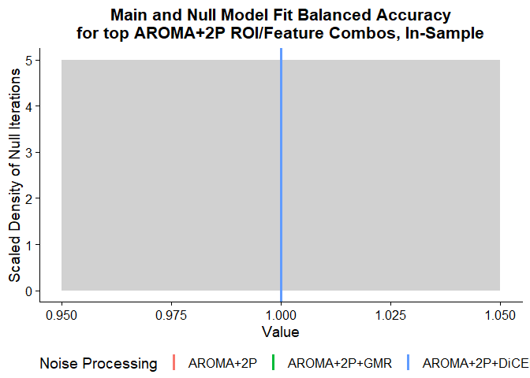<!-- -->

The fitted empirical null model distribution is fairly similar to the
real accuracy and balanced accuracy values using in-sample linear SVM
with no reweighting.

<table class="table" style="width: auto !important; margin-left: auto; margin-right: auto;">
<thead>
<tr>
<th style="text-align:left;">
Noise_Proc
</th>
<th style="text-align:right;">
balanced_accuracy
</th>
<th style="text-align:left;">
bal_acc_p
</th>
</tr>
</thead>
<tbody>
<tr>
<td style="text-align:left;">
AROMA+2P
</td>
<td style="text-align:right;">
1
</td>
<td style="text-align:left;">
1e+00
</td>
</tr>
<tr>
<td style="text-align:left;">
AROMA+2P+GMR
</td>
<td style="text-align:right;">
1
</td>
<td style="text-align:left;">
1e+00
</td>
</tr>
<tr>
<td style="text-align:left;">
AROMA+2P+DiCER
</td>
<td style="text-align:right;">
1
</td>
<td style="text-align:left;">
1e+00
</td>
</tr>
</tbody>
</table>

### In-sample, inverse probability weighted

<!-- -->

The fitted empirical null model distribution is fairly similar to the
real accuracy and balanced accuracy values using in-sample linear SVM
with no reweighting.

<table class="table" style="width: auto !important; margin-left: auto; margin-right: auto;">
<thead>
<tr>
<th style="text-align:left;">
Noise_Proc
</th>
<th style="text-align:right;">
balanced_accuracy
</th>
<th style="text-align:left;">
bal_acc_p
</th>
</tr>
</thead>
<tbody>
<tr>
<td style="text-align:left;">
AROMA+2P
</td>
<td style="text-align:right;">
1
</td>
<td style="text-align:left;">
1e+00
</td>
</tr>
<tr>
<td style="text-align:left;">
AROMA+2P+GMR
</td>
<td style="text-align:right;">
1
</td>
<td style="text-align:left;">
1e+00
</td>
</tr>
<tr>
<td style="text-align:left;">
AROMA+2P+DiCER
</td>
<td style="text-align:right;">
1
</td>
<td style="text-align:left;">
1e+00
</td>
</tr>
</tbody>
</table>

### CV, inverse probability weighted

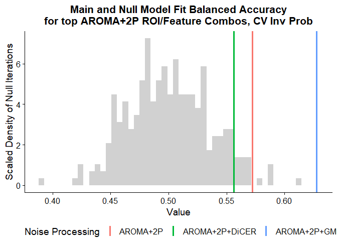<!-- -->

The fitted empirical null model distribution is fairly similar to the
real accuracy and balanced accuracy values using in-sample linear SVM
with no reweighting.

<table class="table" style="width: auto !important; margin-left: auto; margin-right: auto;">
<thead>
<tr>
<th style="text-align:left;">
Noise_Proc
</th>
<th style="text-align:right;">
balanced_accuracy
</th>
<th style="text-align:left;">
bal_acc_p
</th>
</tr>
</thead>
<tbody>
<tr>
<td style="text-align:left;font-weight: bold;color: black !important;background-color: palegreen !important;">
AROMA+2P
</td>
<td style="text-align:right;font-weight: bold;color: black !important;background-color: palegreen !important;">
0.5721970
</td>
<td style="text-align:left;font-weight: bold;color: black !important;background-color: palegreen !important;">
2e-02
</td>
</tr>
<tr>
<td style="text-align:left;">
AROMA+2P+GMR
</td>
<td style="text-align:right;">
0.6276515
</td>
<td style="text-align:left;">
0e+00
</td>
</tr>
<tr>
<td style="text-align:left;font-weight: bold;color: black !important;background-color: palegreen !important;">
AROMA+2P+DiCER
</td>
<td style="text-align:right;font-weight: bold;color: black !important;background-color: palegreen !important;">
0.5564394
</td>
<td style="text-align:left;font-weight: bold;color: black !important;background-color: palegreen !important;">
7e-02
</td>
</tr>
</tbody>
</table>

### CV, SMOTE

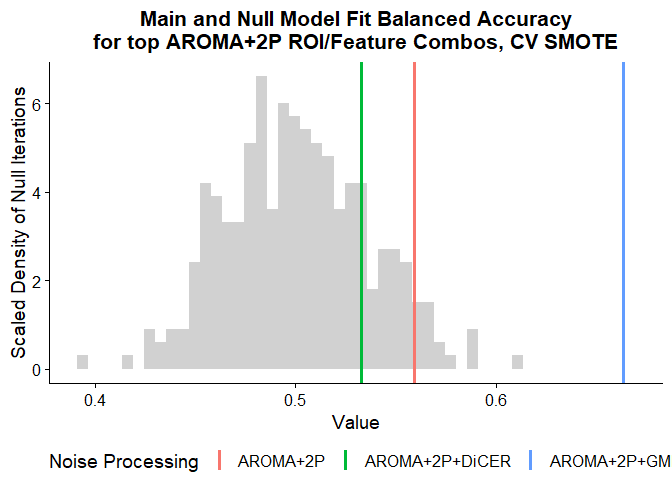<!-- -->

The fitted empirical null model distribution is fairly similar to the
real accuracy and balanced accuracy values using in-sample linear SVM
with no reweighting.

<table class="table" style="width: auto !important; margin-left: auto; margin-right: auto;">
<thead>
<tr>
<th style="text-align:left;">
Noise_Proc
</th>
<th style="text-align:right;">
balanced_accuracy
</th>
<th style="text-align:left;">
bal_acc_p
</th>
</tr>
</thead>
<tbody>
<tr>
<td style="text-align:left;font-weight: bold;color: black !important;background-color: palegreen !important;">
AROMA+2P
</td>
<td style="text-align:right;font-weight: bold;color: black !important;background-color: palegreen !important;">
0.5588636
</td>
<td style="text-align:left;font-weight: bold;color: black !important;background-color: palegreen !important;">
3e-02
</td>
</tr>
<tr>
<td style="text-align:left;">
AROMA+2P+GMR
</td>
<td style="text-align:right;">
0.6634091
</td>
<td style="text-align:left;">
0e+00
</td>
</tr>
<tr>
<td style="text-align:left;font-weight: bold;color: black !important;background-color: palegreen !important;">
AROMA+2P+DiCER
</td>
<td style="text-align:right;font-weight: bold;color: black !important;background-color: palegreen !important;">
0.5325758
</td>
<td style="text-align:left;font-weight: bold;color: black !important;background-color: palegreen !important;">
1.8e-01
</td>
</tr>
</tbody>
</table>

## Comparing model-free shuffle with pooled empirical null distributions

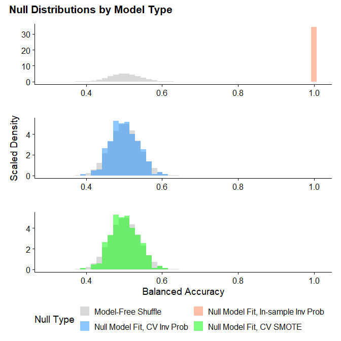<!-- -->
