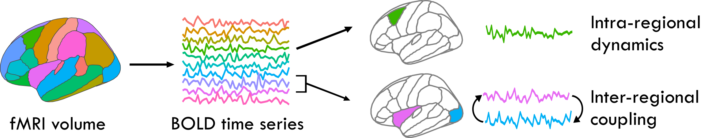
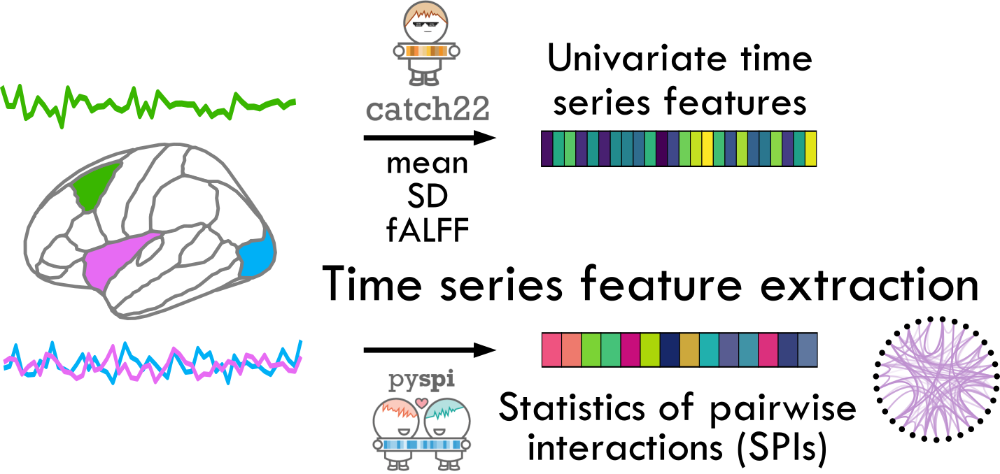
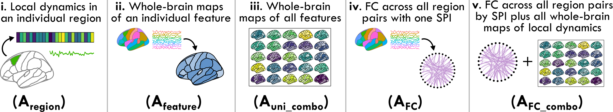

# Systematically comparing feature-based representations of intra-regional and inter-regional brain dynamics

[](https://zenodo.org/doi/10.5281/zenodo.10467890)



This repository contains code to accompany our preprint, "Systematically comparing feature-based representations of intra-regional and inter-regional brain dynamics".
Users may follow this repo to reproduce all analyses and visualizations contained in the preprint -- broadly, this includes extracting time-series features from functional magnetic resonance imaging (fMRI) data to serve as the basis for a series of linear support vector machine (SVM) classifiers for case--control comparisons.

All code is a mixture of R and python, with shell scripts used to execute operations.
Please note that the repository is structured such that some steps are designed to be run on a high-performance computing (HPC) cluster for parallelization with a PBS job scheduler.


# Data availability

All resting-state fMRI data used in this study is freely accessible to the public via open sharing platforms.

* UCLA Consortium for Neuropsychiatric Phenomics (CNP) LA5c study: raw imaging volumes were accessed from OpenfMRI, [accession number ds000030](https://openfmri.org/dataset/ds000030/).
* Autism Brain Imaging Data Exchange (ABIDE) I/II study: preprocessed fMRI time series (with the Harvard-Oxford parcellation atlas) were accessed from Zenodo at [Traut et al. (2020)](https://doi.org/10.5281/zenodo.3625740).

All intermediate data files needed to replicate analysis and visuals in this repo are provided in [this Zenodo repository](https://doi.org/10.5281/zenodo.10431855).

# Usage

## Installation

First, clone this repository to your local machine:

    ```bash
    git clone https://github.com/DynamicsAndNeuralSystems/fMRI_FeaturesDisorders.git
    ```

Parts of this project are in R (v4.3.0), and parts are in Python (v3.9.0).
We recommend that users create a conda environment for this project, which can be accomplished as follows:

    ```bash
    conda create -n fMRI_FeaturesDisorders python=3.9.0
    conda activate fMRI_FeaturesDisorders
    ```

From this conda environment, install the required Python packages:

    ```bash
    pip install -r python_requirements.txt
    ```

R packages required for feature extraction and classification analysis can be installed from `R_requirements.txt` as follows:

    ```bash
    while IFS=" " read -r package version; 
    do 
        Rscript -e "devtools::install_version('"$package"', version='"$version"')"; 
    done < "R_requirements.txt"
    ```

### Data visualization

Additional R packages will be needed to reproduce visualizations for the manuscript in [`generate_all_figures.ipynb`](https://github.com/DynamicsAndNeuralSystems/fMRI_FeaturesDisorders/blob/main/generate_all_figures.ipynb), which can be installed with the following:

    ```bash
    while IFS=" " read -r package version; 
    do 
        Rscript -e "devtools::install_version('"$package"', version='"$version"')"; 
    done < "R_requirements.txt"
    ```

## Preparing data

After downloading the prepared data files from [Zenodo](https://doi.org/10.5281/zenodo.10431855) as listed above, create a `data` folder in this repository and place the downloaded files within that folder.
This will get all files into their needed locations for feature extraction, classification, and visualization described in following.

## Extracting time-series features



Please refer to the [`extract_time_series_features.ipynb`](https://github.com/DynamicsAndNeuralSystems/fMRI_FeaturesDisorders/blob/main/extract_time_series_features.ipynb) Jupyter notebook for a walkthrough of how to extract intra-regional and inter-regional time series features from each participant's blood oxygen level dependent (BOLD) time series.
You can interactively click through each code chunk with a Jupyter notebook reader like VSCode (with the [Jupyter extension](https://marketplace.visualstudio.com/items?itemName=ms-toolsai.jupyter) installed) or the [Jupyter Notebook app](https://anaconda.org/anaconda/jupyter) from Anaconda.

Alternatively, to run the notebook from the command line, you can use the following code:

```
jupyter nbconvert --to notebook --execute extract_time_series_features.ipynb --allow-errors
```

The `--allow-errors` flag allows the whole file to execute even if an error occurs, which can be helpful for debugging (and is optional if you prefer to omit the flag). 
This will yield the file `extract_time_series_features.nbconvert.ipynb` that includes all code output from the notebook.

## Performing case--control classification

Once all intra- and inter-regional time-series features have been computed across all participants, we can fit linear support vector machine (SVM) classifiers for each of the five statistical representations evaluated in the manuscript:



1. **A<sub>region</sub>**: represents each fMRI time series using a set of features capturing 25 dynamical properties of an individual brain region.
2. **A<sub>feature</sub>**: represents each fMRI time series using a set of features that captures a single dynamical property from all brain regions (82 for SCZ, BP, and ADHD, and 48 for ASD).
3. **A<sub>uni_combo</sub>**: represents each fMRI time series using a set of features combining the 25 time-series properties of each individual brain region.
4. **A<sub>FC</sub>**: represents each fMRI time series using a set of features that capture all pairs of inter-regional coupling strengths computed using a single statistic of pairwise interactions (SPI).
5. **A<sub>FC_combo</sub>**: represents each fMRI dataset as a set of features that capture all pairs of inter-regional coupling from a given SPI (as A<sub>FC</sub>) as well as 25 time-series properties of all individual brain regions (as A<sub>uni_combo</sub>). 

These representations are all evaluated using [`fit_classifiers.ipynb`](https://github.com/DynamicsAndNeuralSystems/fMRI_FeaturesDisorders/blob/main/fit_classifiers.ipynb), which can also be run interactively in a Jupyter notebook viewer or run from the command line using:

```
jupyter nbconvert --to notebook --execute fit_classifiers.ipynb --allow-errors
```

## Data visualization

All figures included in the manuscript can be recreated using the Jupyter notebook [`generate_all_figures.ipynb`](https://github.com/DynamicsAndNeuralSystems/fMRI_FeaturesDisorders/blob/main/generate_all_figures.ipynb).
You can run this from the command line and view outputs with the following:

```
jupyter nbconvert --to notebook --execute fit_classifiers.ipynb --allow-errors
```

## Contact

If you have any questions or need further assistance, please contact [annie.bryant@sydney.edu.au](mailto:annie.bryant@sydney.edu.aum).
