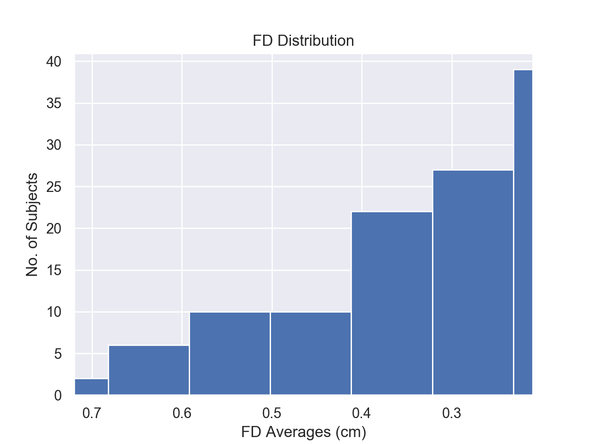

# _catch22_ for cfg.mat files

This repository provides code that facilitates
a) feature extraction using [_catch22_](https://github.com/chlubba/catch22) from time series stored in _cfg.mat_ files and
b) subsequent statistical classification.

The aim of analysis on the example fMRI dataset used was to classify schizophrenic vs healthy controls.

There are two Python files to be run:
* `catch22_cfg_data.py`, which handles the catch22 analysis of _cfg.mat_ data files. Features extracted are stored in a _c22_roiTSx_DATASET.txt_ file.

* `packagedCode`, which references analysis functions that process the feature data, and output useful numerical and graphical information
s
The code and figures below will correspond to the analysis of the COBRE dataset. Only change the variables referenced below (all other variables may remain as they are).

### 1. Generating the time series feature datafile
Open `catch22_cfg_data.py`. At the bottom of the file, choose a dataset, the path to the folder containing the dataset and select which brain parcellation (i.e. roiTS) will to be analysed before running.
Yields `c22_roiTS1_COBRE.txt`.

### 2. Variable assignment and data processing required prior to running '_packagedCode.py_'
Variables that need to be assigned:
* _filePath_: reference the location of the file that stores the framewise displacement (fd) averages of the dataset being analysed
* _threshold_fd_: select an fd value to filter the subjects by
* _subPath_: navigate to the folder containing all of the subject data

To filter the subjects by the threshold_fd value assigned, run:

```python
TS_path_names, indices2Keep = af.removePathNames(filePath, threshold_fd, TS_path_names)
```
More variables that need to be assigned:
* _element_: store the string 'element1_COBRE.txt'
* _feature_: select a feature (feat) to analyse
* _ROI_: select a region of interest (ROI) to analyse
* _dataset_: label the dataset (COBRE)
* _csvPath_: navigate to the 'participants.csv' file for the COBRE dataset

Run the below code to add an indexing system:
```python
tsData, ROIs, subjects, feats, featList = af.addIndices(element,subPath,PyFeatList)
```

To calculate the total number of controls and patients (SCZ), use the below code:
```python
Control, SCZ, Total, SCZ2Ctrl = af.giveMeSubjectNums(targetCol)
```

### 3. Analysis functions and their outputs
The main analysis functions and their outputs are listed below. It is assumed that all required inputs have been provided to the function.

#### a) Region-by-Region Analysis

Run:
```python
af.Reg_by_Reg_Anal(ROI, tsData, targetCol, ROIs, indices2KeepMat, regAccOnly, dispFigs)
```

Yields:
* 10-fold CV score and average classification accuracy +/- error (printed)
* Top 5 ROIs in terms of classification accuracy (printed)
* Mean accuracy and error across all ROIs (printed)
* Scatter plot of PC1 v PC2 in the selected ROI
* Violin plots of the top 5 features in the selected ROI
* Frequency histogram of the classification accuracies across all ROIs

**Figure 1a : PCA scatter plot of ROI 1**


**Figure 1b : Violin plots of top 5 features in ROI 1**


**Figure 1c : Distribution of classification accuracies across all ROIs**


#### b) Feature-by-Feature analysis

Run:
```python
af.Feat_by_Feat_Anal(feature, featureName, element, subPath, PyFeatList, indices2KeepMat, targetCol, featAccOnly, dispFigs)
```

Yields:
* The same as above, but all plots are for the selected feature instead of the selected ROI

**Figure 2a : PCA scatter plot of feature 1**


**Figure 2b : Violin plots of top 5 ROIs in feature 1**


**Figure 2c : Distribution of classification accuracies across all features**


#### c) t-value histograms for all features

Run:
```python
af.showMeTValHistograms(element,subPath,PyFeatList,dataset,indices2KeepMat,targetCol)
```

Yields:
* The t-value distribution for each of the 22 features analysed

**Figure 3 : t-value histograms (all features)**


#### d) Joint plot of both datasets

Given access to the 'sortedFeats' file for both datasets (where fp1 corresponds to UCLA, and fp2, to COBRE), run:
```python
af.showMeJointPlot(fp1,fp2)
```

Yields:
* A joint plot showing which features are performing the best in both datasets

**Figure 4 : Joint plot of the features**


#### e) Combined p-values (Fisher's method)

Given access to the 'featBalancedAcc_shuff' file for both datasets (where fp1 & fp3 corresponds to UCLA, and fp2 & fp4, to COBRE), run:
```python
af.computeCombPVals(fp1,fp2,fp3,fp4,feats)
```

Yields:
* The combined p-values for all features across both datasets

#### f) FD vs balanced accuracy plot

Given access to the 'fdArray_COBRE_E1' file, run:
```python
af.giveMeFDvBalancedAcc(filePathA)
```

Yields:
* Line plots of the fd vs (ROI & feature) balanced accuracy

**Figure 5 : FD vs balanced accuracy**


#### g) FD-subject dynamics

Given access to the 'fdAvgs_COBRE' file, run:
```python
af.showMeFDAcrossSubs(filePathA,filePathB)
```

Yields:
* Histogram of the fd variation across subjects
* Line plot of the subjects remaining as they are filtered by decreasing fd

**Figure 6a : FD distribution vs no. of subjects**



**Figure 6b : FD averages vs no. of subjects remaining**


